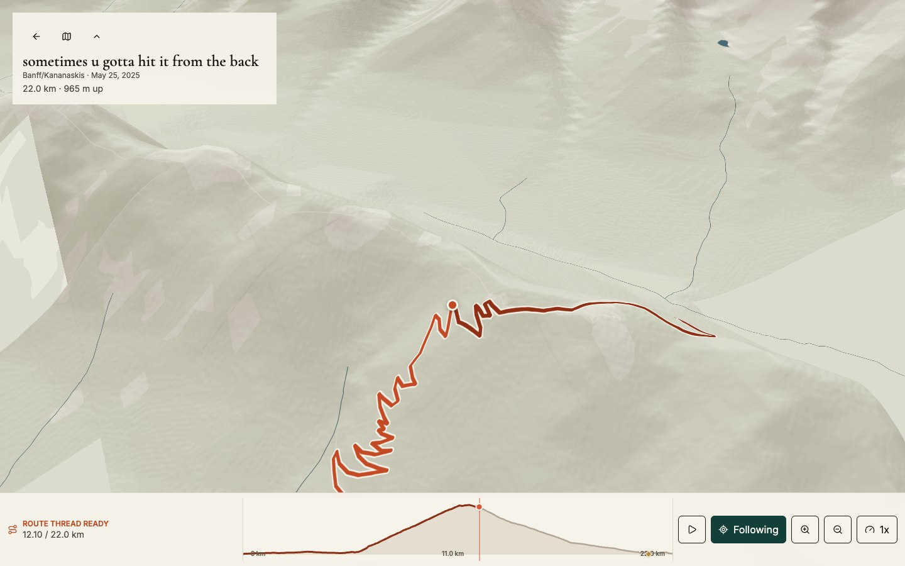
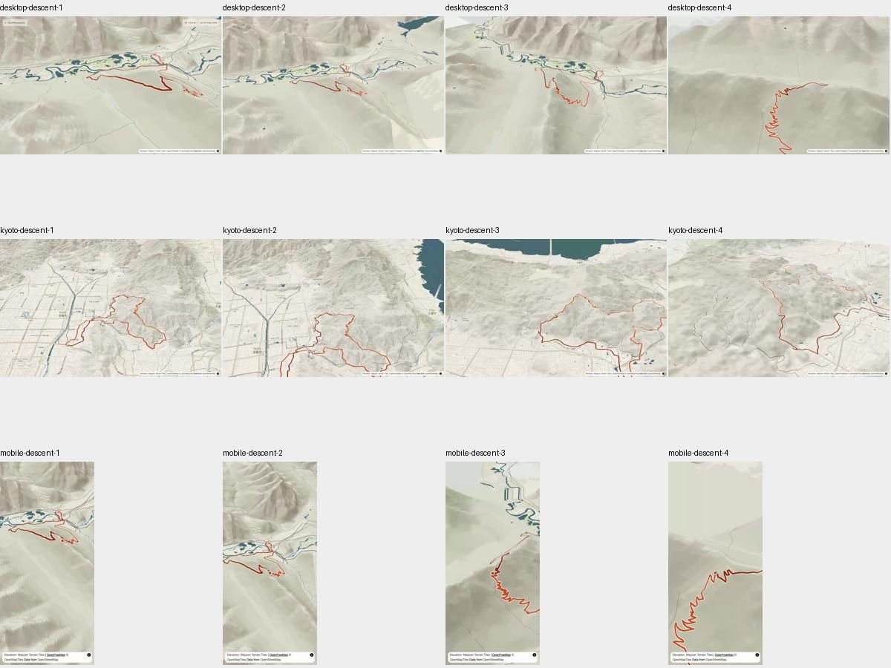

# Direction D continuation

Implementation: `be8028d6c0c8fbe57d741805cfa72eff503b99e8` — `feat(labs): carry D terrain into Replay`.

Local branch: `clanker/feat/direction-d-continuation` in
`/Users/laurenzary/Desktop/godiesel-worktrees/direction-d-continuation`.
It descends directly from saved checkpoint
`a7b377c56de76422be47c0080c0da8432efbff3f`, whose parent is
`2abe97dd82b56c0f32bc91bde6526849d27080ae`. Main and the outgoing worktree were
left untouched, including `.serena/`. No push, PR, merge or deployment.

## Result

D's held point, loaded terrain canvas and final camera now become the existing
Replay renderer. The existing controller owns play, pause, seek and the dock.
The camera tests sightlines to the held point and next 250/600/900 metres from
four sides, choosing a side that reveals the forthcoming terrain. Replay keeps
that geographic bearing through switchbacks. Real occlusion beyond that corridor
remains; recording gaps are absent geometry, never bridging strokes.

The overview corrects its terrain-projected framing for the space around the
page and profile. The map and profile use recorded-distance interpolation and
share one inspection point. Direct route dragging follows projected segments;
a small distance preference retains a held branch at overlaps. Explore explicitly
owns map gestures; the page can move aside while entry remains reachable. Real
Kyoto photographs appear immediately and have direct selectors at their recorded
anchors. Return preserves distance, page state, photograph and reading position.

Warm paper and terracotta terrain continue into Replay. Original titles, place,
date, provider attribution and the existing player remain. D opts in through
`landscape=notebook`; B and ordinary Replay keep their existing presentation.
The shared initial-distance seed now occurs before the first renderable pose.

## Review and evidence

[Open the local review](http://127.0.0.1:8793) for all recordings, descent frames,
assertions and before/after comparisons. Durable files:
`/Users/laurenzary/Desktop/design-handoff/direction-d-continuation/`.
The review server is local; restart it with
`python3 -m http.server 8793 --bind 127.0.0.1 --directory /Users/laurenzary/Desktop/design-handoff/direction-d-continuation`.

- [Unedited desktop journey](/Users/laurenzary/Desktop/design-handoff/direction-d-continuation/desktop-journey.mp4)
- [Unedited phone-emulation journey](/Users/laurenzary/Desktop/design-handoff/direction-d-continuation/mobile-journey.mp4)
- [Unedited Kyoto enrichment journey](/Users/laurenzary/Desktop/design-handoff/direction-d-continuation/kyoto-journey.mp4)

MP4 files are full-length transcodes; original WebM files accompany them.
Intermediate frames were extracted from those recordings, with no staged cuts.
The same-route Banff comparison holds 12.00 km in the saved view and 12.10 km in
the continuation; it does not pretend to be a pixel match at an identical metre.

The independent reviewer scored four corrections **resolved**: forthcoming-route
legibility, overview framing, measured phone targets and removal of the redundant
Replay eyebrow. This is a verdict on those four fixes, not whole-product approval.
The named Impeccable roles were unavailable; fresh agents used the supplied
substitute reviewer and documenter contracts.

All nine committed inherited stills and supplied desktop/mobile/Kyoto videos were
inspected via extracted frames; the current checkpoint was also reproduced live
before editing. Source hashes in
[evidence provenance](evidence/direction-d-continuation/provenance.json) tie the
recordings to the implementation. Capture occurred before committing. The sole
later source delta is documented there: restore the nonvisual Replay landmark
name and reindent its engine mount. Camera, styling and interaction code match.

## Observed verification

| Check | Result |
| --- | --- |
| Inherited `verify:direction-d`, saved server 8787 | 20 passed before edits |
| Current `BASE=http://localhost:8789 npm run verify:direction-d` | 22 passed |
| `npm run typecheck` | Passed |
| `npm run test:unit` | 301 passed, 50 files |
| `npm run build` | Passed |
| `npm run test:bundle` | Passed; initial shell 234.9 KiB; Replay remains lazy |
| `npm run test:e2e:core` | 105 passed in the final run |
| `npm run test:e2e:extended` | 178 passed, 2 existing microsite skips; current D tree, not the historical 177-pass run |
| `capture-direction-d.mjs` | 55 assertions across desktop, phone emulation and Kyoto |
| `verify-direction-d-resilience.mjs` | 31 passed: Crete collection/long title, Treviso flat urban, Calgary laps, Tokyo, reduced motion, delayed/unavailable DEM |
| `verify-direction-d-manipulation.mjs` | 6 passed: direct dragging on Banff switchbacks and Calgary overlap, visible-terrain projection, ordinary Kyoto phone scrolling |
| B comparison | Zero differing pixels for region/day at 1440×900 and 390×844 against saved server 8787 |

The raw journeys establish the exact initial Replay distances before playback:
12,102 m desktop Banff, 12,133 m emulated phone Banff and 7,572 m Kyoto. They also
check advancing playback, pause, the visible return link, browser history and
one surviving canvas. The sampled eye clears terrain and the selected point
stays inside the viewport across intermediate descent frames. These samples are
bounded observations, not proof for every possible future camera position.

The resilience matrix checks that elevation arrival beneath a held pointer
preserves the selected distance. A wholly blocked DEM disables entry, explains
incomplete terrain and retains climb/keyboard inspection. During manipulation,
marker-to-projection errors were under 0.001 px; terrain ray-return errors were
3.2 m in Banff and 31.2 m in Calgary. Those tolerances describe the actual DEM
surface, not survey-level precision. Phone application controls measured at least
48×48 px, desktop at least 44×44 px. Provider credits retain their exception.

The standard core/extended suites use mocked provider contracts. The dedicated
D scripts separately exercised live OpenFreeMap and Mapzen DEM with headed
Chromium on the Mac GPU. Transient tile errors occurred in an earlier capture;
the final three journeys returned with ready terrain. Such errors remain explicit
partial/unavailable states. Known Node colour-environment warnings appeared in
Playwright; there were no application errors in the final recorded journeys.

## Limits and follow-on

- Live Google imagery: blocked by absent browser credentials, checked by presence
  only. No credential values were printed or committed.
- Physical-device touch: untested. Phone evidence uses Chromium touch emulation.
- Review covers representative routes and recorded journeys, not every route,
  every camera position or an entire end-to-end playback of all activities.
- Production Atlas findability remains follow-on work. D stays in the lab and
  does not replace production navigation, records, generated data or curation.

## Run locally

From this continuation worktree's `app/`, run
`npm run dev -- --port 8789 --strictPort`.

- [Banff region](http://localhost:8789/#/lab/design-seeds/d/atlas?region=Banff%2FKananaskis&route=15573295095)
- [Kyoto day](http://localhost:8789/#/lab/design-seeds/d/story/17654151284?region=Kyoto%2C%20Japan)
- [Crete collection](http://localhost:8789/#/lab/design-seeds/d/atlas?region=Crete%2C%20Greece&route=14130782031)
- [B comparison](http://localhost:8789/#/lab/design-seeds/b/story/15573295095?region=Banff%2FKananaskis&theme=journal)

`theme`/`type` remain review parameters, not product controls. The D journey uses
no review palette or font overrides.

Run each dedicated script with `BASE=http://localhost:8789 node scripts/<name>`.
Capture defaults to a directory under `/tmp`, outside Playwright's `test-results`
cleanup. Set `OUT` to retain another copy. Do not use the same output directory as
an active Playwright test run.
