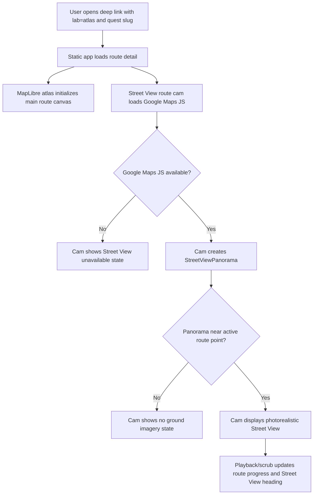
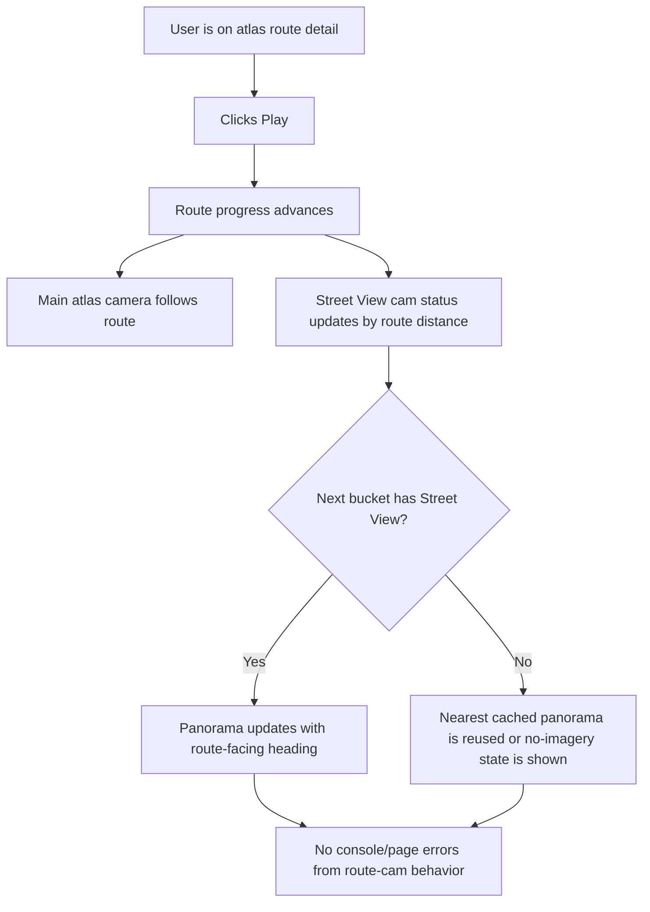
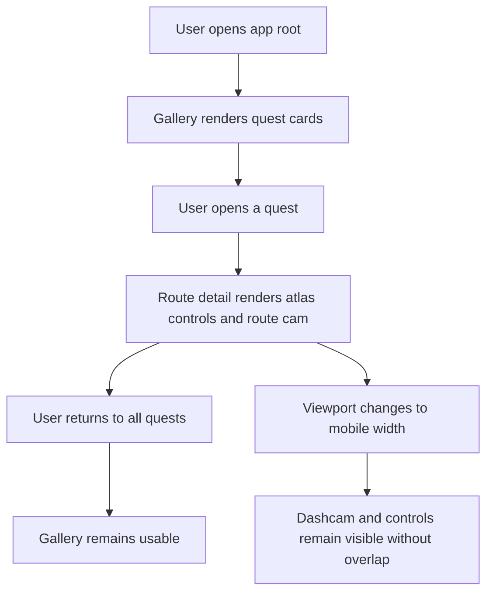

# Dogfood Report - clanker/quest-atlas

> Diff-scoped browser QA of `clanker/quest-atlas` latest Street View route-cam change. Generated by `/ce-dogfood-beta` on 2026-06-13.

## Diff Summary

- Scope note: this local repo has no `main`, `master`, or remote trunk ref, so this run is scoped to `HEAD~1..HEAD` (`ca76c96 feat(ui): add street view route cam`) plus adjacent atlas behavior it depends on.
- `build.py` now reads `GOOGLE_MAPS_API_KEY` from `.env` and injects it into the generated static app.
- The atlas route-cam inset changed from a MapLibre terrain/map viewport to a Google `StreetViewPanorama` embedded in the dashcam frame.
- Route playback now samples Street View panoramas near route points, caches lookups by route bucket, and sets panorama POV heading from route bearing.
- The cam has explicit loading and no-imagery fallback states when Google Maps or nearby Street View coverage is unavailable.
- `dist/index.html` was regenerated from `build.py` for deployment.

## Personas

No `STRATEGY.md`, `VISION.md`, `PERSONAS.md`, or `docs/personas/` files exist in this repo. Personas are inferred from the product and branch diff.

- **Route owner / memory reviewer** - wants their real Strava routes to feel vivid and truthful, without fake or mismatched personal photos.
- **Runner or rider choosing a quest** - wants to preview the route experience quickly and understand whether the quest feels worth doing.
- **Static-site deployer** - wants the generated `dist/` app to work locally and on Cloudflare Pages with browser-safe API key restrictions.

## Flows Tested

### Flow 1 - Deep-link into atlas Street View playback

### Flow 2 - User controls route playback

### Flow 3 - Gallery and responsive regression

## Test Matrix & Results

| # | Flow | Journey / Scenario | Status | Issue | Fix | Commit |
|---|------|--------------------|--------|-------|-----|--------|
| 1 | Deep-link atlas | Open `?lab=atlas#quest/13935098460`; route detail, main atlas, and Street View cam render. | Pass | - | - | - |
| 2 | Deep-link atlas | Confirm route cam uses Google Street View imagery, not MapLibre tiles; label/status copy matches Street View. | Pass | - | - | - |
| 3 | Playback | Click Play/Pause and verify route distance, progress thumb, and Street View status update together without page errors. | Pass | - | - | - |
| 4 | Playback | Scrub to mid-route and finish; verify panorama lookup is cached/reused or no-imagery state is clear. | Pass | - | - | - |
| 5 | Coverage fallback | Open a likely low-coverage route and verify missing Street View does not show fake map cam as photorealistic content. | Pass | Greece mid-route showed `no imagery`; Highwood and Canary sampled points had Street View coverage. | - | - |
| 6 | Gallery regression | Navigate from root gallery into a route and back to all quests; gallery remains usable and no photo UI returns. | Pass | - | - | - |
| 7 | Responsive | At mobile viewport, route cam, controls, and header remain readable and do not overlap incoherently. | Fixed | Route cam overlapped playback controls at 390x844. | Raised mobile route cam above control stack and narrowed inset; added static regression test. | 2b4b940 |
| 8 | Build/test regression | Run Python tests and static build/package checks after browser QA. | Pass | - | - | - |

## What Was Fixed

### Mobile route cam overlapped controls - `2b4b940`

- **Symptom:** At a 390x844 mobile viewport, `routeCam` overlapped `.scrubber-wrap`; playback controls and the Street View inset occupied the same vertical band.
- **Root cause:** The mobile `.route-cam` offset was inherited from the earlier terrain-map inset and sat too close to the bottom control stack.
- **Fix:** Updated `build.py` mobile CSS to use `bottom: 214px` and `width: min(260px, calc(100% - 20px));`, then regenerated `dist/index.html`.
- **Regression test:** Added `test_static_ui.py`, which asserts the mobile route-cam offset and confirms the route cam is wired to Google Street View rather than a MapLibre inset.

## Console Errors

None observed in the tested journeys with `agent-browser errors`.

## Human Verifications

None required for local browser behavior. Google Maps billing/domain restrictions for production should be verified in Google Cloud before deploy.

## Decisions for a Human

None.

## Paper Cuts (by Persona)

- **Route owner / memory reviewer, medium:** Street View coverage can be sparse or discontinuous on real routes. The current no-imagery state is honest, but the product could later precompute coverage and communicate "Street View available for X% of this route" before playback.
- **Runner or rider choosing a quest, low:** `agent-browser open` sometimes timed out while external map resources continued loading even though the page was usable. This did not produce page errors, but perceived loading could be polished with clearer route-cam readiness states.
- **Static-site deployer, low, fixed:** `README.md` still said "No map API key is required," which was stale for Street View route-cam behavior. Fixed in this dogfood pass.

## Learnings

- Street View in the route cam is materially closer to the requested Project Genie-inspired experience than a second map viewport.
- The route cam must be tested as a full journey: deep link, autoplay, scrub, fallback, gallery regression, and mobile layout. The inset can pass on desktop while failing mobile.
- Browser navigation may time out because Google/MapLibre resources keep loading; DOM state and `agent-browser errors` were better pass/fail signals for this static app.

## Final Status

Ready for local iteration and deploy testing after the mobile fix. Remaining caveat: production Google Maps key restrictions and billing must include the deployed domain before Cloudflare Pages release.
