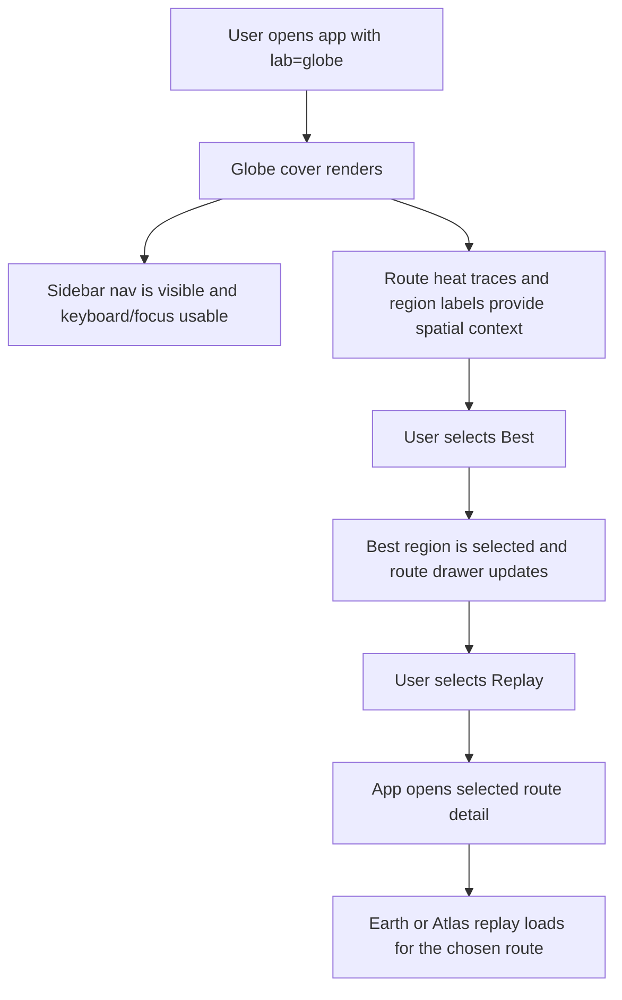
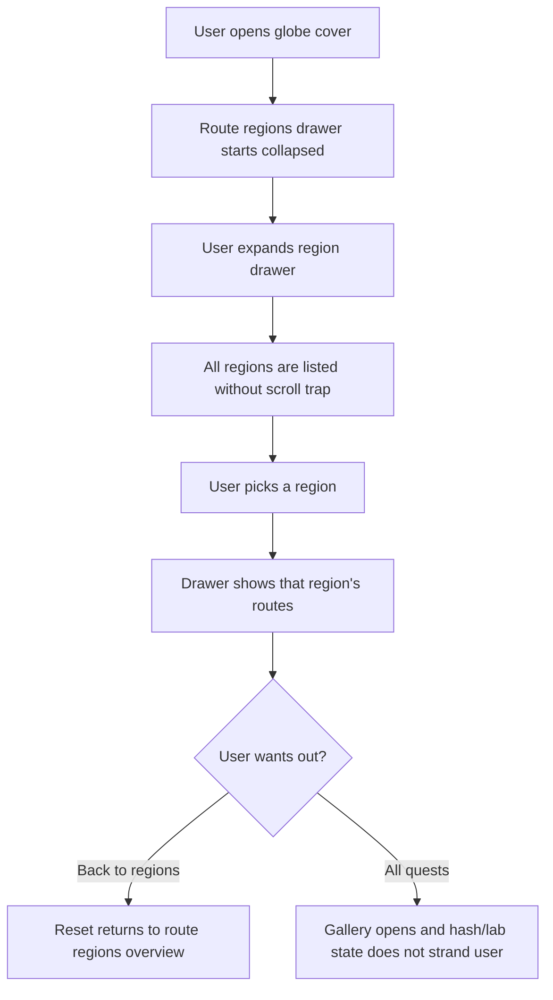
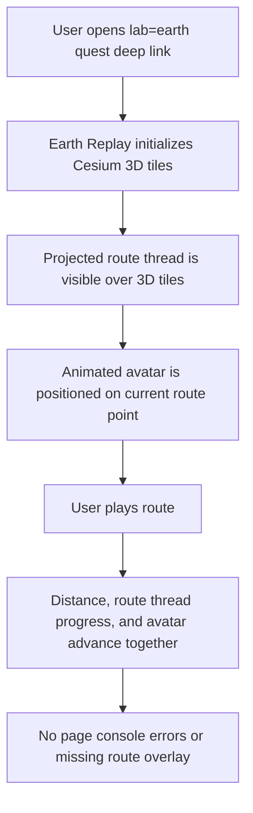
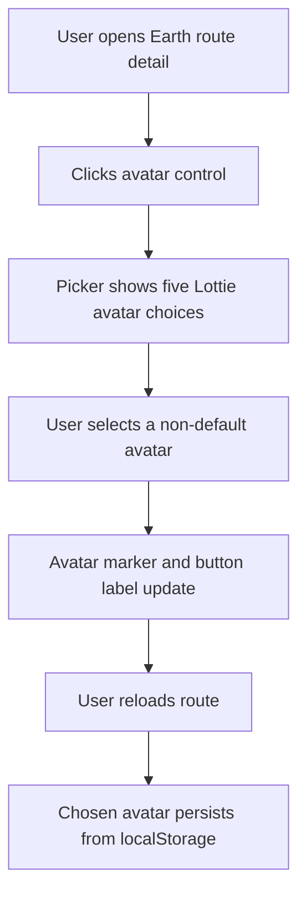
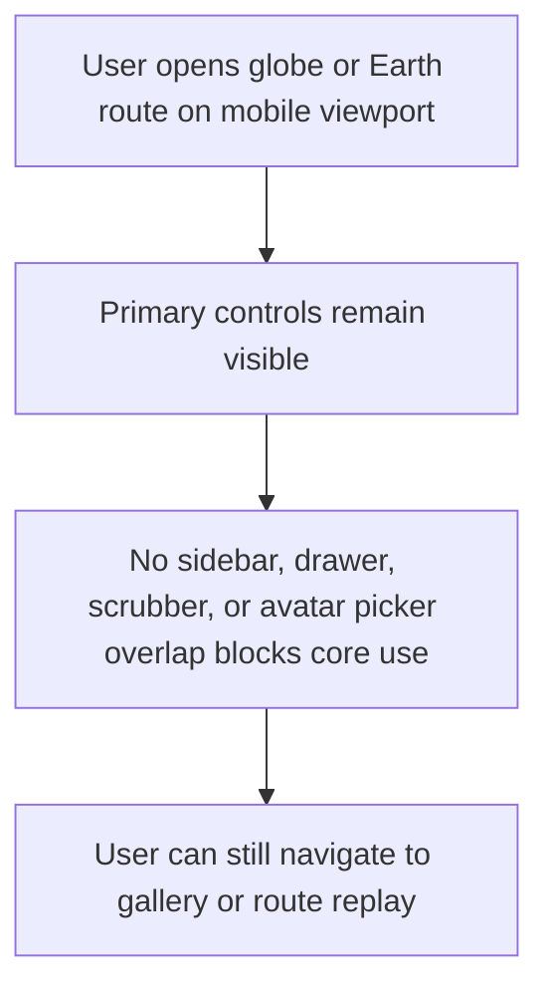

# Dogfood Report - clanker/quest-atlas

> Diff-scoped browser QA of `clanker/quest-atlas` vs practical base `d836472` (`feat(ui): add earth replay toggle`). Generated by `/ce-dogfood-beta` on 2026-06-20.

## Diff Summary

- Scope note: this local repo has no `main`, `master`, or remote trunk ref, so this run is scoped to `d836472...HEAD`. That covers the current unreported iteration set after the original Earth Replay toggle.
- Earth Replay added a persistent projected route thread overlay so the route remains visible while photorealistic 3D tiles are in motion.
- Earth Replay replaced the static route marker with selectable animated Lottie avatars and persisted the avatar choice in `localStorage`.
- The route avatar set was finalized as Run Rex, Nyan Cat, Mario, Walking, and Hangout Running; the astronaut option was removed.
- The new `?lab=globe` cover page renders a Three.js globe, region selector, route heat traces, and a sidebar navigation rail for Heatmap, Best, Replay, and All Quests.
- Static output, route avatar assets, generated quest cards, and tests were regenerated to match the current branch.

## Personas

No `STRATEGY.md`, `VISION.md`, `PERSONAS.md`, or `docs/personas/` files exist in this repo. Personas are inferred from the product and branch diff.

- **Route owner / memory reviewer** - wants real Strava routes to feel vivid, truthful, and emotionally specific without fake visuals or mismatched media.
- **Runner or rider choosing a quest** - wants to preview routes quickly, understand what looks best, and open a compelling replay without learning hidden URL parameters.
- **Static-site deployer** - wants the generated `dist/` app to work locally and on Cloudflare Pages with stable static assets and no broken browser dependencies.

## Flows Tested

### Flow 1 - Globe cover discovery to route replay

### Flow 2 - Globe region drawer and All Quests escape

### Flow 3 - Earth Replay route visibility and animated avatar

### Flow 4 - Avatar picker persistence

### Flow 5 - Responsive regression

## Test Matrix & Results

| # | Flow | Journey / Scenario | Status | Issue | Fix | Commit |
|---|------|--------------------|--------|-------|-----|--------|
| 1 | Globe discovery | Open `?lab=globe`; verify globe cover, sidebar nav, route heat traces, and collapsed regions drawer render. | Pass | - | - | - |
| 2 | Globe discovery | Click Best, then Replay; verify selected region updates and replay opens a concrete quest route. | Pass | - | - | - |
| 3 | Globe drawer | Expand route regions, select a region, reset to all regions, then open All Quests. | Pass | - | - | - |
| 4 | Earth Replay | Open `?lab=earth#quest/13807396994`; verify Earth canvas, route thread, and avatar marker render without page errors. | Pass | - | - | - |
| 5 | Earth Replay | Play/pause route; verify route distance advances and route thread/avatar remain visible. | Pass | - | - | - |
| 6 | Avatar picker | Open avatar picker, select Nyan Cat, reload, and verify persisted avatar selection. | Pass | - | - | - |
| 7 | Responsive | Test mobile `?lab=globe`; verify nav, globe, and route drawer do not overlap incoherently. | Pass | - | - | - |
| 8 | Responsive | Test mobile `?lab=earth#quest/13807396994`; verify scrubber, avatar picker, route thread, and controls remain usable. | Blocked (human decision) | Earth Replay intentionally gates narrow viewports into a desktop-first fallback, so route thread/avatar are not expected to render on mobile today. | - | - |
| 9 | Build/test regression | Run static build/package and Python test suite after dogfood. | Pass | - | - | - |

## What Was Fixed

None. No small unambiguous implementation bugs were found that should be auto-fixed in this pass.

## Console Errors

None observed from `agent-browser errors` in the tested desktop globe, desktop Earth, avatar picker, and mobile globe journeys.

## Human Verifications

None required for local browser behavior. External Google Maps / Cesium tile availability may still depend on API key, billing, browser GPU support, and network conditions in production.

## Decisions for a Human

### Mobile Earth Replay behavior

- **What's broken:** The dogfood matrix initially expected mobile `?lab=earth#quest/13807396994` to show the route thread and animated avatar. Instead, the app marks Earth mode unavailable on a 390x844 viewport and shows the desktop-first fallback.
- **Why escalated:** This is not an accidental regression. The repo's Earth Replay plan, brainstorm, and spike explicitly allow a desktop-first fallback for mobile while photorealistic 3D playback is being tuned.
- **Options:** Keep the desktop-first gate and test mobile Earth as a fallback state; or remove/relax the gate and accept new performance/layout risk on mobile GPUs.
- **Recommendation:** Keep the gate for now. If mobile Earth becomes a product goal, make it a planned feature with its own performance budget and browser matrix rather than a dogfood hotfix.

## Paper Cuts (by Persona)

- **Route owner / memory reviewer, low:** The route heat traces on the globe read as tiny bright strokes at world scale. They become more meaningful after selecting a region, but the default cover still relies on labels to explain where route clusters are.
- **Runner or rider choosing a quest, low:** After opening a route from Globe Replay, the URL keeps `?lab=globe` alongside the quest hash. The detail renders correctly, but the URL semantics are slightly confusing.
- **Static-site deployer, low:** Earth Replay remains sensitive to external Google/Cesium resource availability. Local behavior passed, but production readiness still depends on API restrictions and tile availability.

## Learnings

- `agent-browser` correctly exercises the local static app even while the in-app Browser MCP path is broken.
- Visible user controls matter for testing. A raw selector matched a hidden duplicate `showGallery()` button, but the visible Quests nav button worked correctly.
- Mobile Earth should be evaluated as an intentional fallback until the product explicitly chooses to support photorealistic 3D playback on narrow viewports.

## Final Status

Ready for desktop/local iteration with one explicit product caveat: mobile Earth Replay remains intentionally desktop-first. The Globe cover, region drawer, desktop Earth route thread, animated avatar picker, avatar persistence, mobile Globe layout, static build, dist packaging, and Python tests all passed.

Screenshots captured during this run:

- `/tmp/godiesel-dogfood-01-globe.png`
- `/tmp/godiesel-dogfood-02-replay-from-globe.png`
- `/tmp/godiesel-dogfood-03-globe-drawer.png`
- `/tmp/godiesel-dogfood-04-earth-route-thread.png`
- `/tmp/godiesel-dogfood-05-earth-playing.png`
- `/tmp/godiesel-dogfood-06-avatar-picker.png`
- `/tmp/godiesel-dogfood-07-mobile-globe.png`
- `/tmp/godiesel-dogfood-08-mobile-earth-missing-thread.png`
