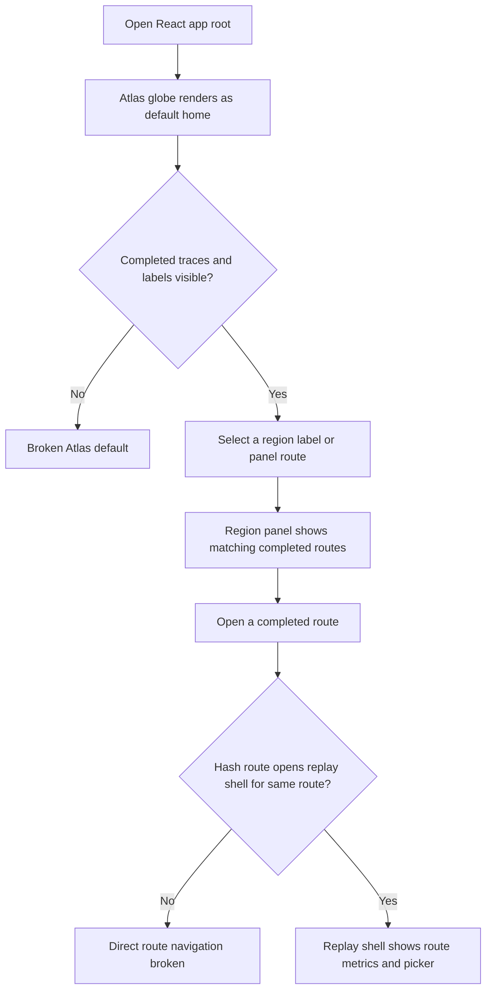
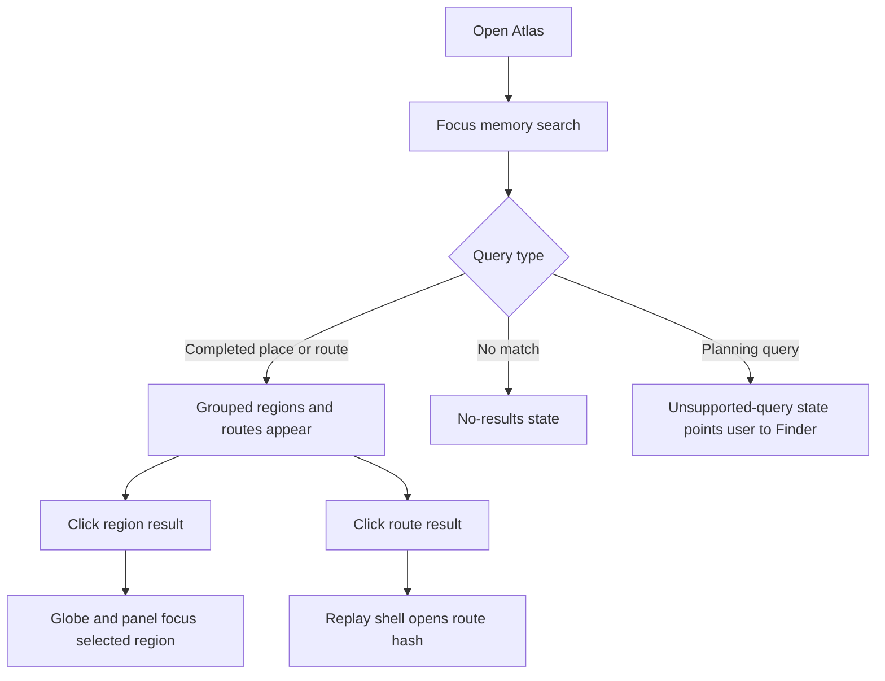
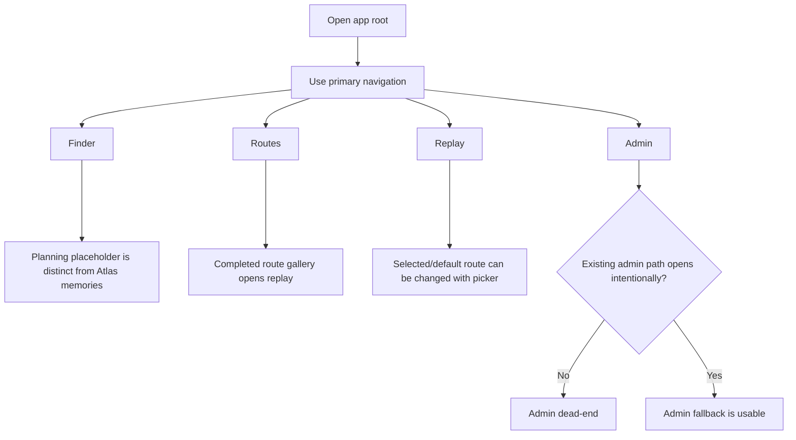
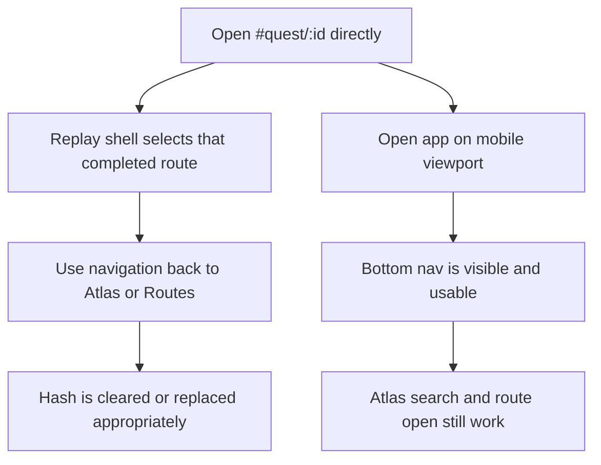
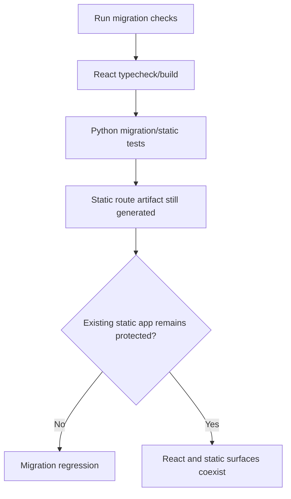

# Dogfood Report - clanker/quest-atlas

> Diff-scoped browser QA of `clanker/quest-atlas` for the React migration work. Generated by `/ce-dogfood-beta` on 2026-06-22.

## Diff Summary

- Added a Vite React, TypeScript, Tailwind, and shadcn-style app under `app/`.
- Added a persistent app shell with `Atlas`, `Finder`, `Routes`, `Replay`, and `Admin` navigation.
- Added generated React route data, TypeScript route lifecycle/domain models, and route-region grouping.
- Made the React root open to an Atlas globe with completed route heat traces, region selection, and Atlas memory search.
- Kept `Routes`, `Replay`, `Finder`, and `Admin` as first-milestone React surfaces while static app parity remains in progress.
- Extended `build.py` and migration tests to emit and validate the React route artifact while preserving the static app path.

## Personas

Source: inferred from `docs/brainstorms/2026-06-21-godiesel-react-migration-requirements.md`.

- **Runner owner** - Lauren uses the app to remember completed runs/rides, replay them, and plan future routes without losing the personal atlas feel.
- **Future runner user** - A runner wants a low-friction split between completed memories and future route planning.
- **Route curator** - Maintains route data and needs static generation plus the new React app to stay understandable and runnable during migration.

## Flows Tested

### Flow 1: Atlas Memory To Replay

### Flow 2: Atlas Search States

### Flow 3: App Navigation And First-Milestone Surfaces

### Flow 4: Deep Link And Responsive Navigation

### Flow 5: Static And Build Safety

## Test Matrix & Results

| # | Flow | Journey / Scenario | Status | Issue | Fix | Commit |
|---|------|--------------------|--------|-------|-----|--------|
| 1 | Atlas Memory To Replay | Root loads Atlas as default with nonblank globe, completed route labels, and region panel. | Pass | Screenshot `/tmp/godiesel-dogfood-s1-root.png`; pixel check found 18,530 unique colors in globe crop. | - | - |
| 2 | Atlas Memory To Replay | Click a globe/region result and verify the selected region panel updates to matching completed routes. | Pass | Canary Islands label updated the panel to six Canary routes. | - | - |
| 3 | Atlas Memory To Replay | Open a completed route from Atlas and verify `#quest/:id` replay shell shows matching route metrics. | Pass | Opened `#quest/14422331296`; replay showed Canary Islands, 17.9 km, 282 m, geometry ready. Paper cut: route picker did not surface selected Canary route. | - | - |
| 4 | Atlas Search States | Search `Tokyo`, verify grouped results, select a region, then open a route result. | Pass | Tokyo grouped results focused the Tokyo region and opened `#quest/17665674778`. | - | - |
| 5 | Atlas Search States | Search a no-match query and verify no-results state. | Pass | `zzz-no-route-here` showed "No completed memories match that search." | - | - |
| 6 | Atlas Search States | Search a planning query and verify unsupported-query messaging keeps planning out of Atlas. | Pass | `plan 10k trail near Banff` showed "Planning queries belong in Finder." | - | - |
| 7 | App Navigation And First-Milestone Surfaces | Navigate Finder and verify it is visibly future/planning, not completed history. | Pass | Finder clearly states planning/future route intent and does not show completed history as suggestions. | - | - |
| 8 | App Navigation And First-Milestone Surfaces | Navigate Routes and open a completed route card into replay. | Pass | Routes listed completed cards and opened `#quest/17665674778`. | - | - |
| 9 | App Navigation And First-Milestone Surfaces | Navigate Replay directly and use the completed route picker to change selected route/hash. | Fixed | Mobile-sized viewport exposed picker buttons behind bottom nav; picker also did not pin selected route. Desktop retest selected Kyoto and updated `#quest/17654151284`. | Pinned selected route first and removed mobile internal picker scroller. | 41cd048 |
| 10 | App Navigation And First-Milestone Surfaces | Navigate Admin and verify the existing admin fallback does not dead-end. | Fixed | `Open existing admin` linked to `/admin.html` on Vite, which silently rendered the React SPA/Atlas instead of admin. | Replaced dead link with explicit in-app migration state. | cca3c14 |
| 11 | Deep Link And Responsive Navigation | Open a known `#quest/:id` URL directly, then navigate back to Atlas and Routes. | Fixed | Changing to a `#quest/:id` hash after app mount did not update React state. | Added `hashchange` and `popstate` sync for quest hashes. | d02c68e |
| 12 | Deep Link And Responsive Navigation | Mobile viewport: bottom nav, Atlas search, and route open remain usable without overlap. | Pass | 390x844 viewport: bottom nav visible, search grouped Tokyo results, route opened `#quest/17665674778`; screenshot `/tmp/godiesel-dogfood-s12-mobile-root.png`. | - | - |
| 13 | Static And Build Safety | Run React typecheck/build and Python migration/static tests. | Pass | `npm run typecheck`, `npm run build`, and `/tmp/godiesel-pytest-venv/bin/python -m pytest` passed. Vite still warns about large chunks. | - | - |
| 14 | Static And Build Safety | Run the static generator checks enough to confirm the static app path still works. | Pass | `./rebuild.sh` rebuilt 66 quests and `./make-dist.sh` produced `dist/` with 74 files. | - | - |

## What Was Fixed

### Replay picker context and mobile overlap - `41cd048`

- **Symptom:** A selected route outside the first 12 completed routes did not appear in the replay picker, and at mobile viewport width the fixed bottom nav could cover picker items.
- **Root cause:** `ReplayHome` always rendered `completedRoutes.slice(0, 12)` in a mobile-visible internal scroller.
- **Fix:** Build `pickerRoutes` with `selectedRoute` first, then de-duped completed routes; only apply picker max-height/overflow from `md` upward.
- **Regression test:** `test_replay_picker_pins_selected_route_and_avoids_mobile_nav_overlap`.

### Admin fallback dead link - `cca3c14`

- **Symptom:** The Admin fallback link navigated to `/admin.html` on the Vite dev server, which rendered the React app instead of the local admin.
- **Root cause:** The React app runs from `app/`; relative links to the repo-root static admin file are not served by Vite.
- **Fix:** Replace the link with an explicit first-milestone state that says admin runs separately from the React app.
- **Regression test:** `test_app_shell_defines_expected_navigation_and_hash_route_support` asserts the dead `../admin.html` link is absent.

### Quest hash sync after mount - `d02c68e`

- **Symptom:** Opening or changing to `#quest/:id` after the React app had mounted left the previous view active.
- **Root cause:** The app parsed the initial hash once but did not listen for `hashchange` or `popstate`.
- **Fix:** Add a hash-route sync listener that updates replay state for quest hashes and returns to Atlas for root hashes.
- **Regression test:** `test_app_shell_defines_expected_navigation_and_hash_route_support` asserts hash/popstate listeners exist.

## Console Errors

None observed across the browser matrix.

## Human Verifications

Not applicable. No OAuth, payments, email, SMS, or external write flow is introduced by this diff.

## Decisions for a Human

None.

## Paper Cuts

- **Runner owner / fixed:** Replay picker did not include or pin the currently opened route when that route was outside the first 12 completed routes. Fixed in `41cd048`.
- **Route curator / fixed:** The top-level `Static app` link overpromised a static launch target that Vite does not serve. Replaced it with an explicit React migration preview status.

## Learnings

- Atlas search behavior is clear when it refuses planning intent instead of pretending to find future routes.
- Hash-based route parity needs both initial-load parsing and mounted-app hash synchronization; testing only fresh page loads misses SPA navigation regressions.
- Relative links from the React Vite app cannot reach repo-root static files; unavailable states are safer than dead fallback links until a real local/deployed target is wired.
- Header actions should only advertise destinations the current dev server can actually open.

## Final Status

Ready with notes. All 14 dogfood scenarios now pass or were fixed and re-tested. Remaining caveat: the React app is still pre-parity for full Earth Replay and Finder planning by design; this run only verifies the U1-U4 migration surfaces and first-milestone placeholders.
