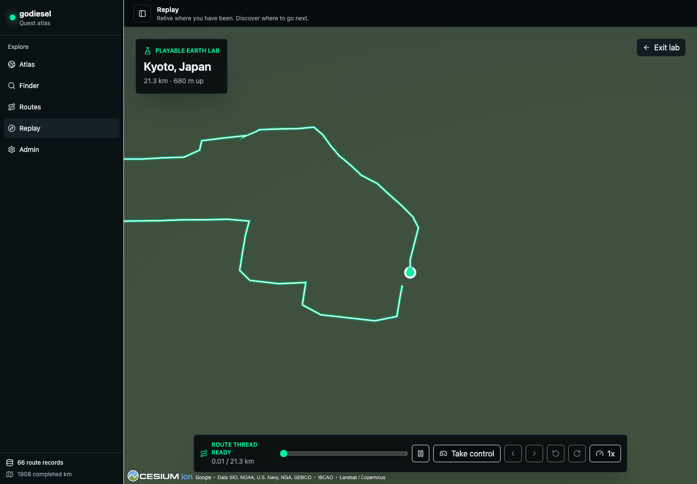
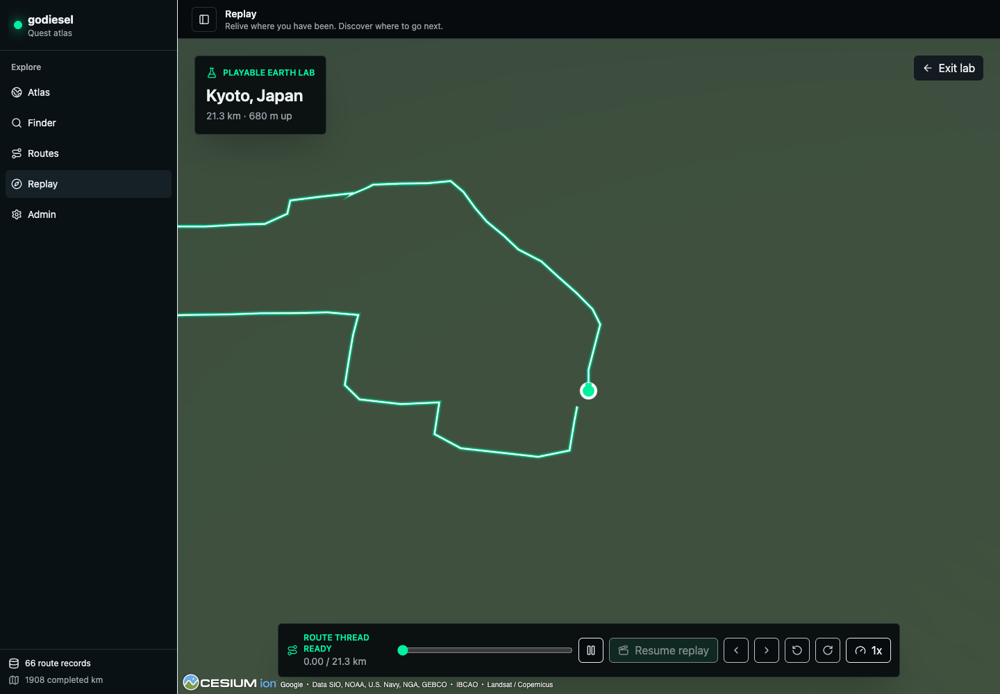
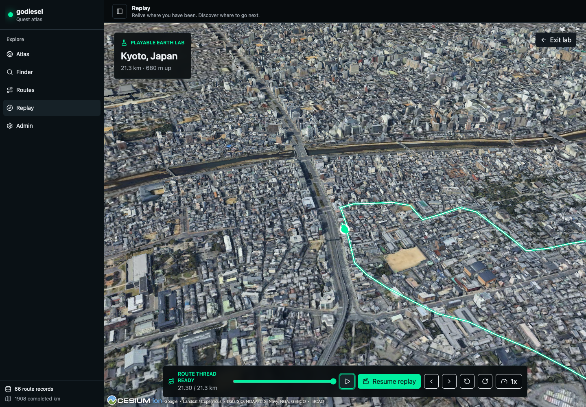

# Playable Earth Guided Agency Scorecard

Date: 2026-07-13

Issue: [#21](https://github.com/the-prairie/goDiesel/issues/21)

Canonical route: Kyoto, Japan (`17654151284`)

Local URL: `http://127.0.0.1:8787/#/lab/playable-earth/17654151284`

## Gate Status

The objective dogfood pass is complete.

The owner completed the subjective gate after using guided replay and the new close route-follow camera.

The owner described the experience as "good," identified the floating route as the next material problem, and explicitly asked to continue.

The approved outcome is to continue to opportunistic surface grounding.

## Method

The route ran continuously for three minutes in automatic replay and three minutes in guided mode against live Google Photorealistic 3D Tiles.

The browser viewport was 1440 by 1000 in Chrome.

Each mode was sampled every 30 seconds for route progress, control mode, lateral offset, camera yaw, canvas count, and approximate requestAnimationFrame rate.

Guided input alternated sustained left and right steering with left and right camera look.

The replay-to-guided transition was also measured near the route end in a separate pass.

The displayed frame rate is a browser requestAnimationFrame estimate, not a GPU frame-time trace.

## Regression Verification

- Production build and TypeScript compilation passed.
- All 39 Vitest unit tests passed.
- All 40 Python tests passed.
- All 57 Playwright tests passed, including Playable Earth guided controls, keyboard input, route changes, failure states, mobile navigation, and overlap checks.
- `git diff --check` passed.

## Objective Results

| Dimension | Result | Evidence |
| --- | --- | --- |
| Camera continuity | Pass | Progress advanced continuously and the Cesium canvas never remounted. No camera discontinuity was observed when switching modes. |
| Camera comfort | Pass | The owner continued using the guided experience and requested a closer route-follow view. |
| Visible grounding | Weak | The route thread becomes legible over settled imagery, but the current marker remains a floating map marker rather than a visibly grounded actor. |
| Tile stability | Mixed | Settled imagery remained usable, but the lab declared `ready` while the canvas was still a flat green surface. Guided camera movement caused 202 aborted tile requests as Cesium replaced superseded requests. |
| Approximate frame rate | Pass | Automatic replay sampled from 118.0 to 121.4 FPS. Guided mode sampled from 119.6 to 120.5 FPS on a 120 Hz display. |
| Mode-switch continuity | Pass | Switching at 20.14 km preserved the same route progress with a measured delta of 0 m. |
| Route-thread legibility | Pass after tile settle | The bright route thread remained readable over dense Kyoto imagery and stayed associated with the current marker. |
| Control clarity | Mixed | Play, progress, speed, and mode controls are clear. Steering and look controls are icon-only, and sustained keyboard input reaches the hard limits quickly. |

## Captured Evidence

The first ready frame shows the false-ready loading condition.

The guided start frame shows the same loading-state problem after the mode switch.

The final guided frame shows the settled world, route thread, current marker, and controls after the full traversal.

## Paper Cuts

- The `ready` state fires before photorealistic tiles are visually ready.
- Sustained steer and look inputs reach the corridor and yaw limits in about seven seconds, which makes keyboard control feel binary.
- The current marker does not make contact with the terrain in a visually convincing way.
- Cesium aborts many obsolete tile requests while the guided camera changes direction.
- A single non-functional 404 appears in the console, likely for a missing browser asset.

These are repairable implementation issues.

They do not by themselves disprove the guided-agency hypothesis.

## Core Hypothesis Questions

Owner response:

1. Taking control and the close route-follow framing are materially worth continuing beyond passive replay.
2. The owner voluntarily returned to the lab, evaluated another route view, and requested the next iteration.

## Allowed Decision

The allowed outcomes were:

- Stop and discard.
- Retain as an isolated lab.
- Continue to opportunistic surface grounding.

Current decision: **Continue to opportunistic surface grounding.**
