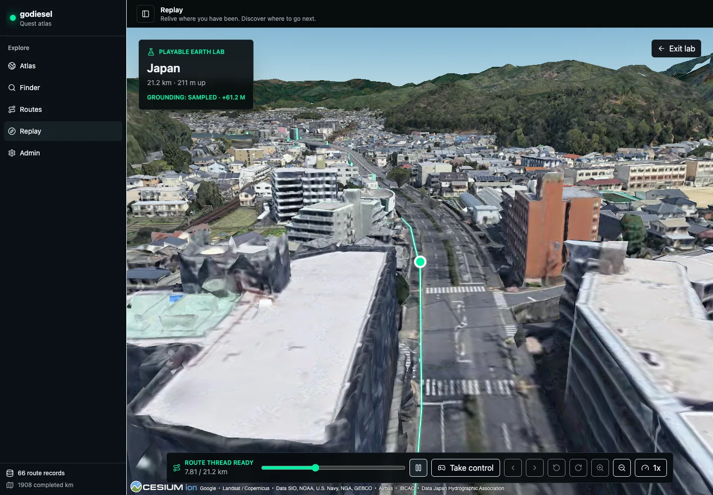
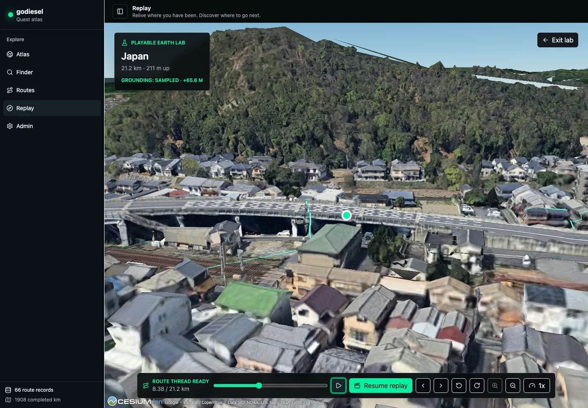
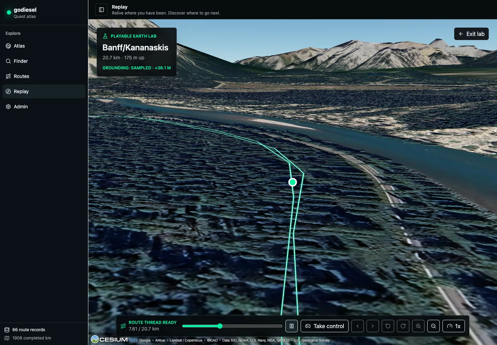
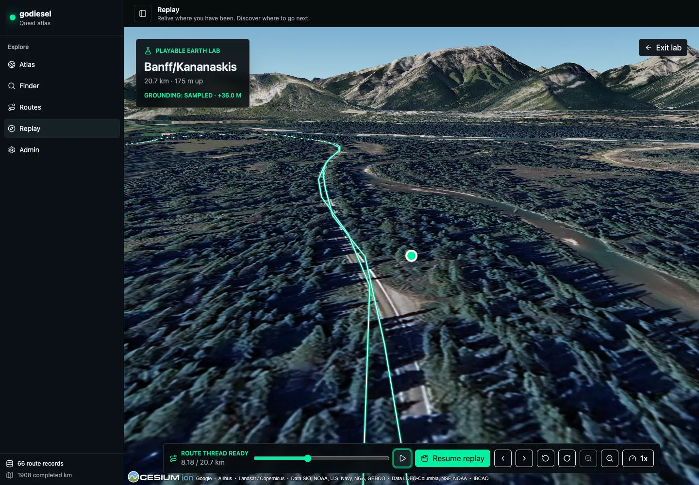

# Playable Earth Urban and Mountain Disposition

Date: 2026-07-14

Issue: [#23](https://github.com/the-prairie/goDiesel/issues/23)

Urban route: Japan (`17626995684`)

Mountain route: Banff/Kananaskis (`13358070690`)

Local URLs:

- `http://127.0.0.1:8787/?debugGrounding=1#/lab/playable-earth/17626995684`
- `http://127.0.0.1:8787/?debugGrounding=1#/lab/playable-earth/13358070690`

## Final Disposition

**Retain Playable Earth as an isolated lab.**

The experiment is worth keeping because the close route-follow camera, photorealistic world, bright route thread, and limited guided agency create a meaningfully different way to revisit a route.

It should not replace normal Replay or enter production scope from this issue.

The current experience still depends too heavily on provider mesh quality, level-of-detail behavior, and experimental control semantics to support a production commitment.

No normal Replay route, navigation, or default behavior changed during this experiment.

## Method

Both routes were exercised in current desktop Chrome at a 1440 by 1000 viewport against live Google Photorealistic 3D Tiles.

Each route was scrubbed to 35 percent, framed at the closest 120 metre route-follow camera, and allowed to settle until sampled grounding was active.

The test then ran automatic replay, switched to guided control with simultaneous steering and camera look, paused for look-around, returned to automatic replay, and resumed movement.

The harness recorded route progress, lateral offset, camera yaw, grounding state, grounding offset, canvas count, request failures, console errors, and approximate requestAnimationFrame rate.

The frame-rate result is a browser requestAnimationFrame estimate, not a GPU frame-time trace.

## Comparison

| Dimension | Urban Japan | Mountain Banff/Kananaskis |
| --- | --- | --- |
| Immediate delight | Strong. The close camera reads like moving through a real city rather than inspecting a map. | Strong. Terrain scale and mountain context make the route feel like a place and not only a trace. |
| Camera comfort | Mixed-positive. 120 metres is legible and immersive, but low-detail buildings can fill the foreground. | Positive. The same range gives a stable runner-adjacent view with a readable horizon. |
| Grounding quality | Sampled throughout with a stable offset near `+65.7 m`. The route follows roads and structures with no visible vertical teleport. | Sampled throughout with a stable offset near `+35.6 m`. The route remains attached to the terrain with no visible vertical teleport. |
| Tile stability | Mixed. No blank canvas or black gap appeared, but warped buildings and mesh substitution remain visible. | Mixed-positive. The terrain stayed coherent, but close imagery is smeared and lower-detail terrain is obvious. |
| Approximate frame rate | `74.3 FPS` automatic and `59.4 FPS` guided. | `105.5 FPS` automatic and `97.9 FPS` guided. |
| Route-thread clarity | Strong over roads, but overlapping or nearby route segments can look like multiple threads. | Strong against dark terrain, although out-and-back geometry can read as doubled lines. |
| Control clarity | Mixed. Take control and resume replay are legible, but paused look-around recentres after input is released. | Mixed for the same reason. The mode is understandable, but look-around does not yet behave like a persistent free camera. |
| Mode-switch continuity | Pass. Pause held at `8,378 m`; replay returned at `8,378 m` and resumed to `8,501 m`. | Pass. Pause held at `8,179 m`; replay returned at `8,179 m` and resumed to `8,295 m`. |
| Render continuity | Pass. One Cesium canvas remained mounted across all modes. | Pass. One Cesium canvas remained mounted across all modes. |

## Evidence

The urban automatic frame shows the route attached to the road network and the close follow camera maintaining forward context.

The urban paused frame shows the value and current limitation of look-around against dense provider geometry.

The mountain automatic frame shows route and terrain scale at the same camera range.

The mountain paused frame shows a coherent route-relative vista without losing the thread.

## Owner Replay Signal

Urban Japan invites voluntary replay.

The owner described the close route-follow experience as good, identified floating route geometry as the next material problem, and explicitly asked to continue after using the Japan route.

Banff/Kananaskis also invites voluntary replay at lab level.

The owner repeatedly returned to mountain Earth routes during development, called the grounded direction good, and asked to continue the experiment.

This is a positive behavioral signal, not a fresh route-by-route product rating or approval to promote the feature.

## Objective Limitations

- The lab follows recorded route geometry and allows only a narrow lateral corridor; it is not free-world navigation.
- The camera is route-relative rather than runner-eye-level, and the closest range can clip or magnify coarse geometry.
- Surface grounding adjusts vertical placement but does not provide collision, locomotion physics, or semantic knowledge of roads and obstacles.
- Approximate requestAnimationFrame rate does not reveal GPU frame-time spikes or lower-powered device behavior.
- Desktop Chrome was tested; this gate does not establish mobile or cross-device readiness.

## Provider Artifacts

- Photorealistic urban buildings deform at close range and can temporarily obscure the route.
- Mountain textures and terrain meshes become visibly smeared at the closest camera range.
- The two routes required materially different vertical offsets, confirming that provider height and recorded activity height cannot be treated as one datum.
- The two-route pass recorded `265` aborted Google tile requests while Cesium replaced superseded requests during camera and route movement.
- Tile detail can settle after the lab reports ready, so ready means the viewer is operable rather than every visible tile is final.

## Implementation Bugs

- Paused look-around recentres toward the route after the user releases look input instead of holding the chosen view.
- A non-functional `404` remains in the browser console, likely for a missing browser asset.
- Dense or repeated route geometry can produce doubled route-thread segments that are technically accurate but visually ambiguous.

## Product-Hypothesis Concerns

- The lab proves that real-world replay can feel more immersive, but it does not yet prove repeated value beyond novelty.
- The most compelling mountain vistas and the most distorted urban close-ups create inconsistent route quality.
- Guided agency is useful as a way to inspect a remembered place, but steering does not yet create meaningful gameplay.
- A production decision needs a separate spec for audience, entry point, success metric, supported devices, provider failure behavior, and route-quality thresholds.

## Regression Verification

- `npm run build` passed.
- All `44` Vitest tests passed.
- All `40` Python tests passed.
- All `59` Playwright tests passed.
- The Playwright suite directly regression checked Atlas, Routes, route guides, normal Replay navigation, canonical URLs, failure states, desktop layouts, and mobile layouts.
- The Playable Earth lab remained isolated at `#/lab/playable-earth/:slug`.

## Retain If Production Is Reconsidered

- Keep the deterministic controller boundary for route progress, mode, corridor, look, speed, and camera range.
- Keep recorded elevation as the reliable fallback and treat sampled surface height as opportunistic.
- Keep the close route-follow camera levels and one-canvas mode continuity.
- Keep the bright ground-classified route thread and explicit failure escape path.
- Keep the lab route isolated until a separate product spec is approved.

## Do Not Promote As-Is

- Do not make the lab the normal Replay default.
- Do not promote the debug query parameter or diagnostic copy into the product UI.
- Do not treat requestAnimationFrame estimates as a production performance budget.
- Do not promise runner-eye-level navigation, collision, or stable photorealistic quality from this prototype.
- Do not expand provider-specific sampling code before a separate production decision defines the supported experience.
