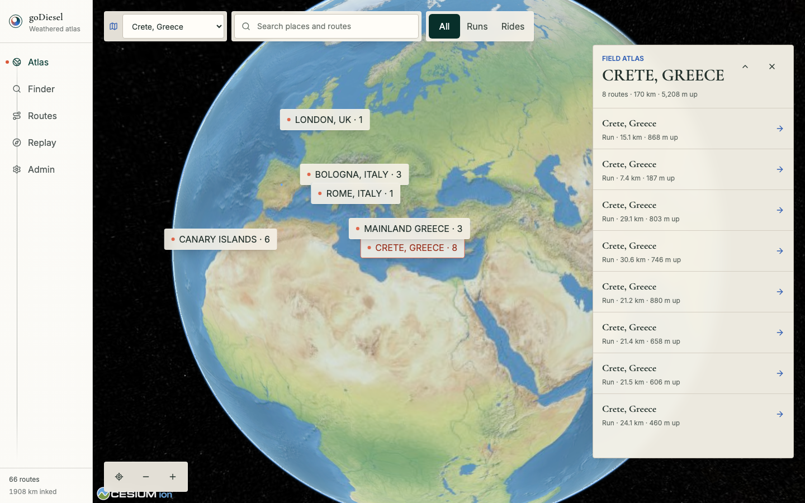
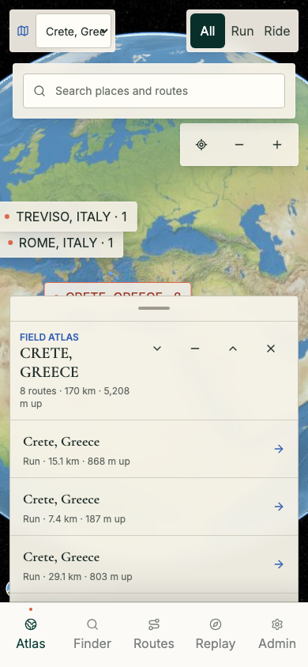

# Issue 86 Cesium Atlas Verification

## Scope

This report verifies the feature-flagged Cesium global Atlas while retaining the Three.js globe as the default fallback.

## Automated Gates

- TypeScript build passed.
- All 89 unit tests passed, including direct production-engine teardown coverage.
- The bundle budget passed with the Cesium world remaining lazy-loaded.
- All six deterministic Cesium Atlas end-to-end scenarios passed, including desktop and mobile rendering, search and camera input, provider fallback, direct URL entry, and renderer teardown.
- All 37 existing Atlas end-to-end scenarios passed against the default Three.js world.
- The complete application end-to-end gate passed 144 journeys, with only the three intentionally opt-in live Earth provider checks skipped.

## Live Cesium Evidence

The live browser used `VITE_ATLAS_WORLD_ENGINE=cesium` against the real Cesium renderer and bundled Natural Earth imagery.

- The WebGL canvas rendered nonblank pixels at 1440 by 900 and 390 by 844.
- All 66 completed route threads were mounted.
- Collision management left five visible place labels on desktop and two on mobile in the tested view.
- Visible labels had no bounding-box collisions, and both region labels and the Cesium canvas exposed visible keyboard focus rings over the world.
- Selecting Crete updated the URL, opened the matching region guide, and reoriented the shared camera while remaining at global altitude.
- Wheel zoom, pointer drag, keyboard navigation, and mobile pinch changed the same Cesium camera.
- Sampled canvas pixels produced 12,665 desktop colors and 16,162 mobile colors, confirming the world was not blank or a static fallback.
- No page errors or console errors were observed.
- A synthetic renderer failure restored the Three.js Atlas without losing the selected URL state.

## Screenshots

## Follow-up Boundary

Issue 87 owns geographic route bounds, close regional terrain, photorealistic tile activation, terrain clamping, and reduced-motion camera transitions.
