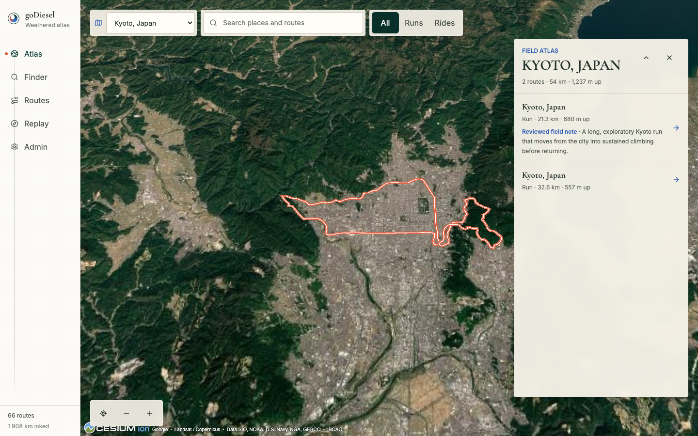
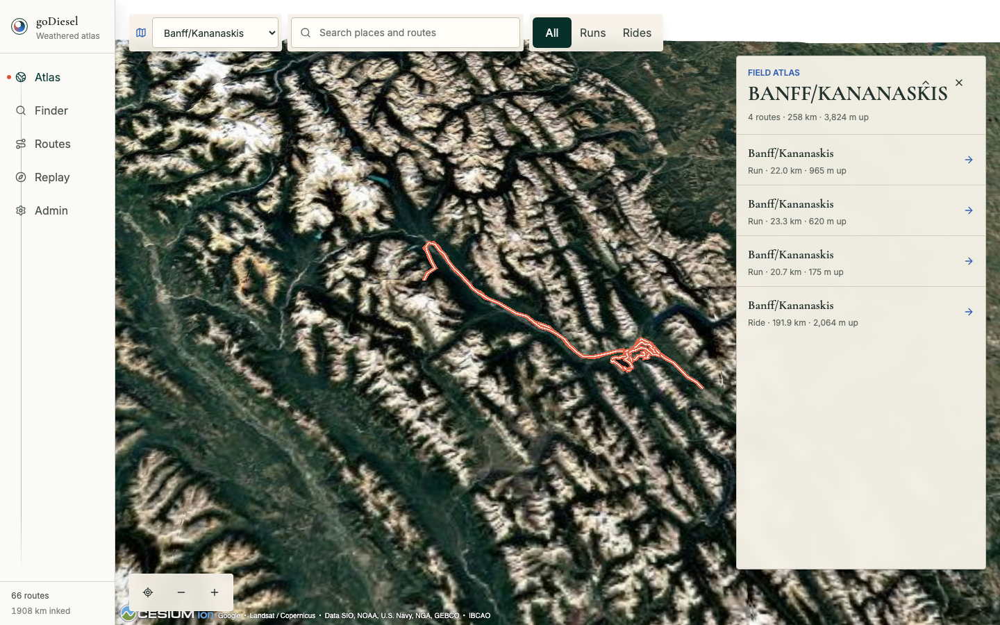
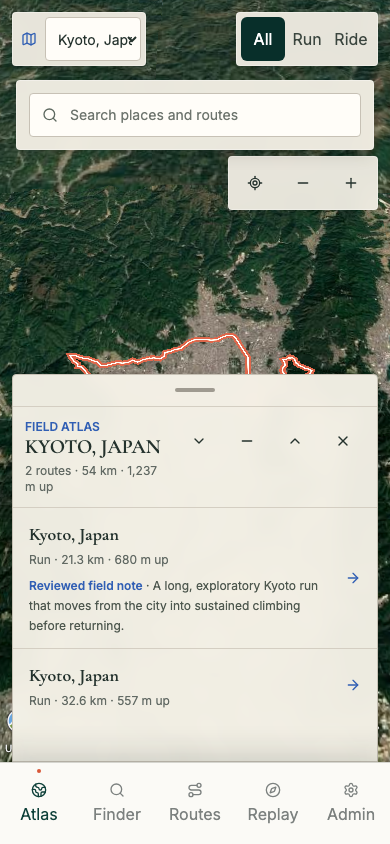
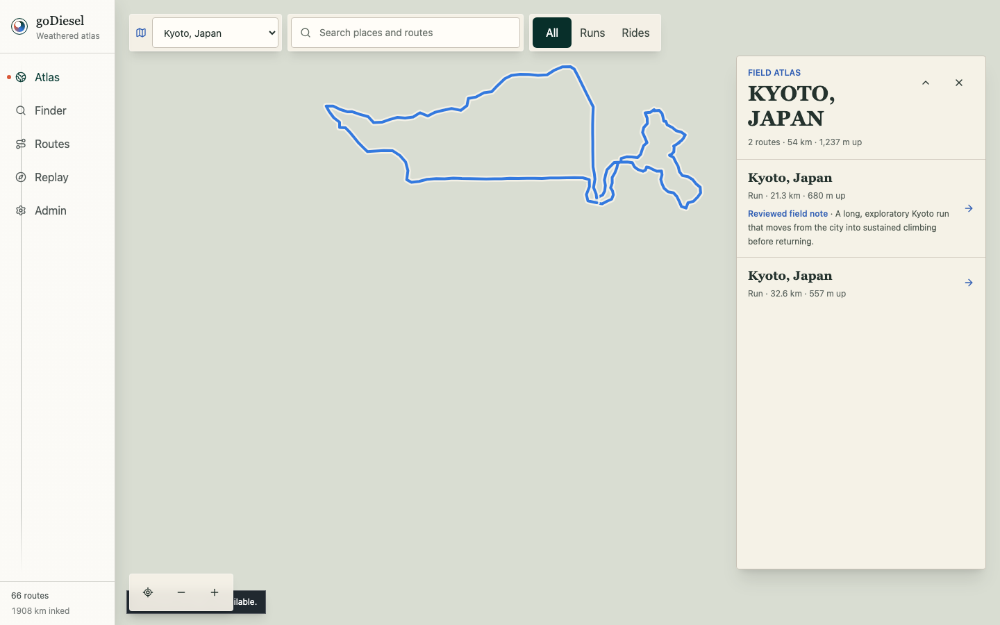

# Issue 87 Regional Terrain Verification

## Scope

This report verifies the globe-to-region transition, recorded route grounding, provider failure handling, and responsive framing required by issue #87.

The live Google provider evidence uses the immutable Cloudflare Pages deployment at `https://3bcbf267.godiesel.pages.dev`.

## Deterministic Checks

- `npm run typecheck`
- `npx vitest run src/atlas/atlas-region-camera.test.ts src/domain/geographic-bounds.test.ts src/data/route-regions.test.ts src/components/globe/atlas-regional-fallback.test.tsx src/components/globe/atlas-world.test.ts`
- `npx playwright test e2e/atlas-cesium.spec.ts`
- `npm run verify`

The deterministic suite covers antimeridian-safe geometry bounds, safe viewport insets, terrain-clamped regional route geometry, reduced-motion timing, stable loading state, repeated provider failure, URL preservation, and a source-backed MapLibre fallback.

## Live Provider Checks

`GODIESEL_ATLAS_PREVIEW_URL=https://3bcbf267.godiesel.pages.dev npm run test:e2e:atlas-live`

The live suite passed for:

- Kyoto, Japan as an urban route set.
- Banff/Kananaskis as a mountainous route set.
- Kyoto, Japan at a mobile viewport.

Measured frames:

| Region | Viewport | Route sphere | Camera range | Result |
| --- | --- | ---: | ---: | --- |
| Kyoto, Japan | Desktop | 7,711 m | 36,746 m | Regional terrain ready |
| Banff/Kananaskis | Desktop | 33,440 m | 159,346 m | Regional terrain ready |
| Kyoto, Japan | Mobile | 7,711 m | 38,884 m | Regional terrain ready |

The live frame review confirmed that the recorded route threads remain grounded and legible, the regional panel does not obscure them, and no black, white, or empty terrain seam remains in the corrected safe-inset projection.

## Failure Recovery

The fallback proof blocks Google tile requests while leaving the selected URL unchanged at `#/atlas?region=Kyoto%2C+Japan`.

The world reports `region-fallback`, MapLibre reports `ready`, and two recorded route traces remain visible through the map-synchronized SVG overlay.

This local provider failure is intentional because the production Google key is restricted to the deployed `godiesel.pages.dev` origin.

## Evidence

### Urban terrain

### Mountain terrain

### Mobile framing

### Source-backed fallback

