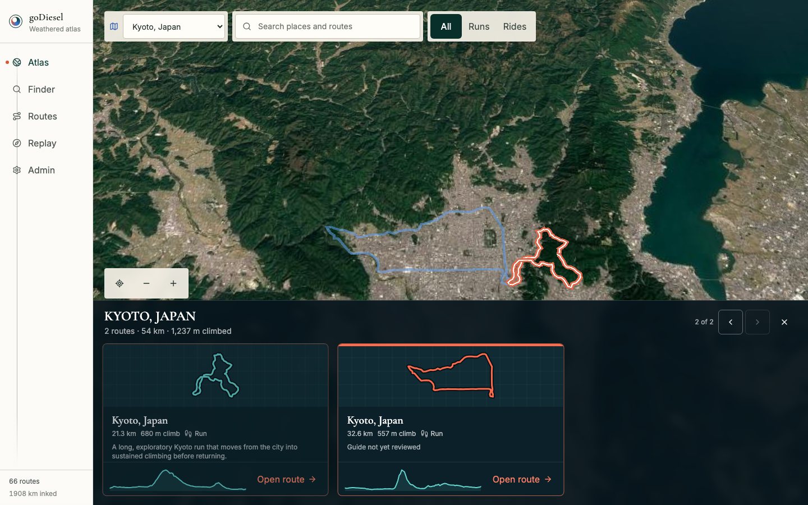
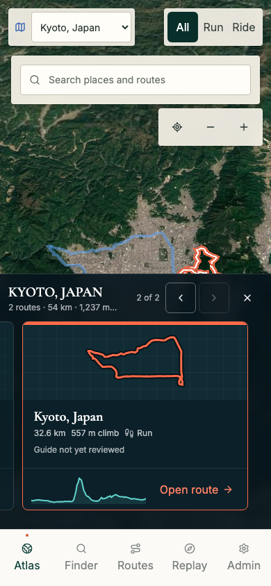

# Issue 88 Route Carousel Verification

## Scope

This report verifies the terrain-synchronized regional route carousel required by issue #88.

The acceptance surface includes readiness gating, source-backed route cards, route selection synchronization, responsive card rhythm, hierarchical browser history, Replay return context, accessibility, and provider-backed terrain.

## Deterministic Checks

- `npm run typecheck`
- `npx vitest run src/components/globe/region-route-carousel.test.tsx src/atlas/cesium-atlas-world-engine.test.ts`
- Focused Atlas and carousel Playwright checks across desktop, tablet, mobile, and short landscape viewports.
- Independent read-only code review against issue #88 and the approved spatial Atlas specification.
- `npm run verify`

The final release gate passed 112 unit tests and 155 browser tests.

Six live-provider tests remain intentionally skipped in the default suite because they require the local Google Maps credential.

The bundle budget passed with Replay and route detail remaining lazy-loaded.

## Interaction Proof

The browser suite verifies that the carousel remains hidden until regional terrain is ready, then exposes the correct source-backed route count and facts.

Pointer drag, previous and next controls, direct card selection, carousel keyboard navigation, and terrain-thread selection update one canonical route slug.

The selected route card is centered and uses the same restrained coral emphasis as the active terrain thread.

Browser Back and Escape now move through `route` to `region` to global Atlas one level at a time.

Opening any card in Replay records that exact Atlas route selection and restores it on return.

One-route regions retain stable dimensions with bounded navigation.

## Responsive Proof

The deterministic matrix covers 18 Atlas viewport combinations plus dedicated desktop, tablet, mobile, and short-landscape carousel checks.

Desktop presents three-card regional rhythm where neighboring route data exists.

Tablet presents one centered primary card with enough adjacent route content to exceed two visible card-width equivalents.

Mobile presents one centered primary card with route peeks and no horizontal document overflow.

The selected region control remains legible at 390 pixels while preserving the compact 320-pixel layout.

## Live Provider Checks

`GODIESEL_ATLAS_PREVIEW_URL=http://127.0.0.1:8787 npm run test:e2e:atlas-live`

The live Google 3D Tiles suite passed for:

- Kyoto, Japan on desktop.
- Banff/Kananaskis on desktop.
- Kyoto, Japan on mobile.

All three cases reached settled `region-ready` terrain with a visible synchronized carousel and a nonblank Cesium canvas.

The externally hosted immutable preview was not created because the execution environment blocked uploading workspace build artifacts to Cloudflare Pages.

The equivalent provider gate was completed locally on the Google-approved `127.0.0.1:8787` referrer.

## Evidence

### Desktop regional carousel

### Mobile regional carousel

## Residual Risk

Google 3D Tiles availability still depends on API key referrer policy and provider availability.

The existing source-backed MapLibre fallback preserves region and route selection when that provider is unavailable.
