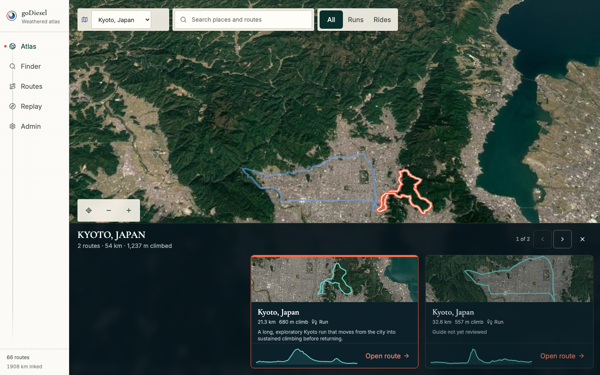

# Issue 89 Route Preview Verification

## Scope

This report verifies the source-backed regional route previews and editorial context required by issue #89.

The acceptance surface includes lazy Google Static Maps requests, paths derived from recorded route geometry, honest reviewed and draft copy, stable loading and failure dimensions, deterministic fallbacks, and real-provider evidence.

## Deterministic Checks

- `npx vitest run src/components/globe/route-satellite-thumbnail.test.ts src/components/globe/region-route-carousel.test.tsx`
- `npx playwright test e2e/atlas-cesium.spec.ts --grep "route thumbnails|failed satellite imagery"`
- Independent read-only code review against issue #89.
- `npm run verify`

The final release gate passed 118 unit tests and 157 browser tests.

Seven credentialed provider tests remain intentionally skipped in the default suite.

The bundle budget passed with Replay and route detail remaining lazy-loaded.

## Imagery Contract

Each eligible card requests a Google Static Maps satellite image with a path derived from its recorded route geometry.

The path adapter validates coordinates, preserves both endpoints, and downsamples long routes to at most 36 points.

Embla's actual visible slide window determines which cards may load imagery, extended by one immediate neighbor on each side.

Cards that have never entered that window remain deferred.

Completed thumbnails remain mounted so carousel movement does not duplicate network requests, while unfinished offscreen requests return to deferred state.

No card mounts an independent map renderer.

## Editorial And Failure Proof

Reviewed routes show their reviewed route vibe.

Routes without reviewed curation show the neutral label `Guide not yet reviewed` and do not invent claims.

A forced Google Static Maps `503` preserves the card dimensions, recorded SVG route trace, elevation profile, route facts, and neutral editorial state.

Missing credentials or unusable geometry enter the same deterministic preview path without a broken image placeholder.

## Live Provider Checks

`GODIESEL_ATLAS_PREVIEW_URL=http://127.0.0.1:8787 npm run test:e2e:atlas-live`

The live provider suite passed four cases:

- Kyoto, Japan source-backed 3D terrain on desktop.
- Banff/Kananaskis source-backed 3D terrain on desktop.
- Kyoto, Japan regional framing on mobile.
- Real Google Static Maps satellite thumbnails for visible Kyoto route cards.

The thumbnail case verified a loaded image with nonzero natural dimensions over a settled regional Cesium world.

## Evidence

### Live Kyoto satellite previews

## Residual Risk

Google 3D Tiles and Static Maps availability still depend on billing, API enablement, referrer restrictions, quota, and provider availability.

The deterministic trace and elevation fallback preserves route selection and useful route context whenever thumbnail imagery is unavailable.
