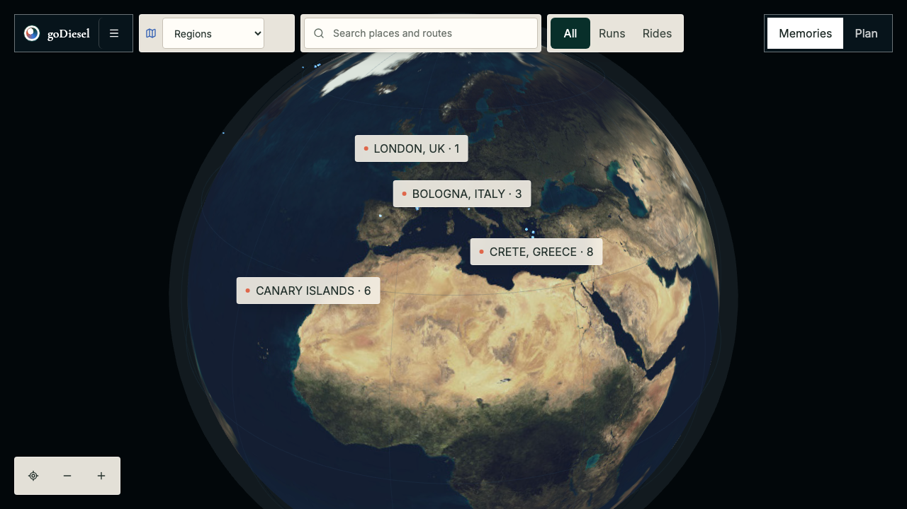
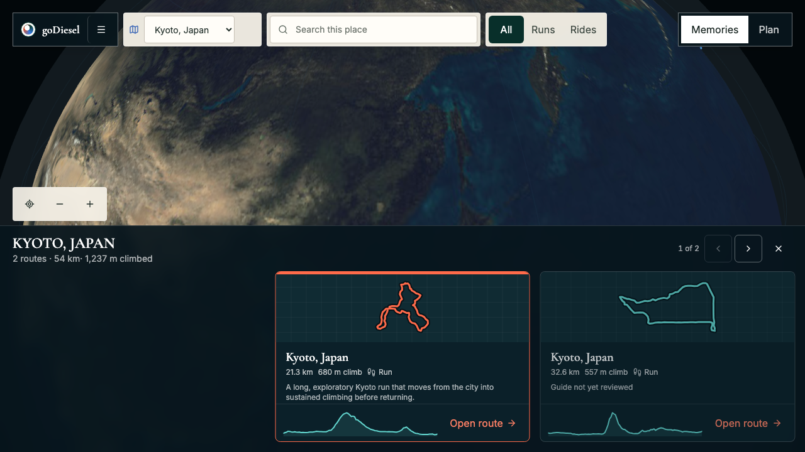
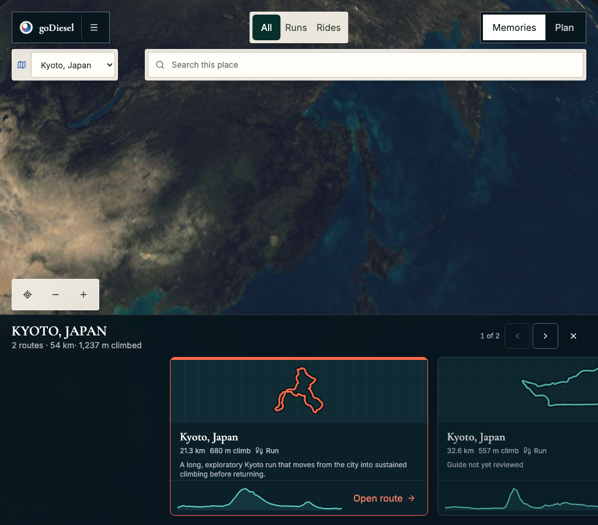
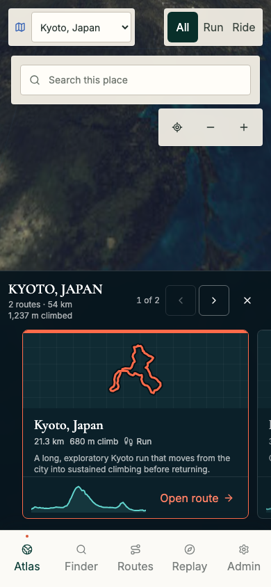
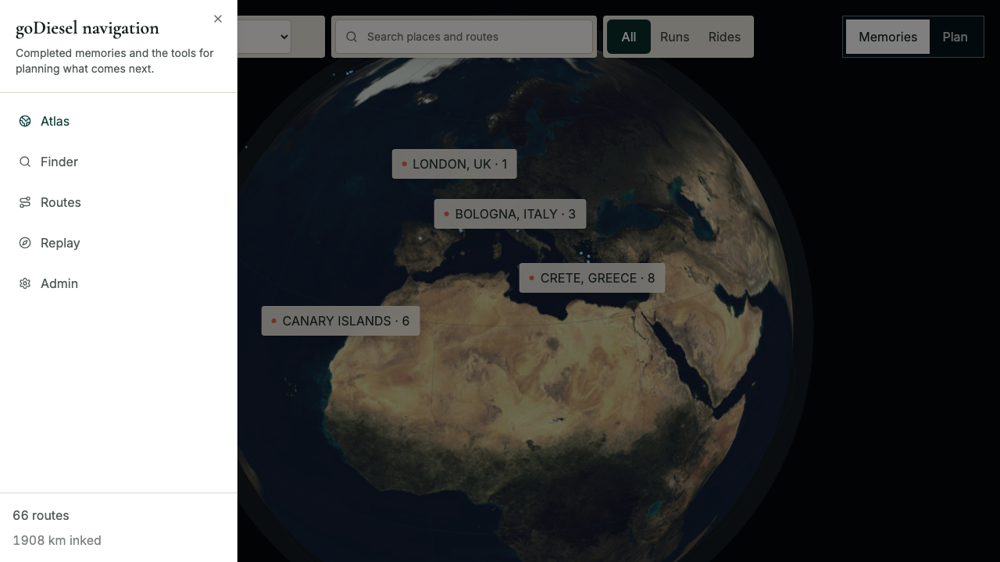

# Issue 90 Immersive Atlas Shell Verification

## Scope

This report verifies the responsive, geography-first Atlas shell required by issue #90.

The acceptance surface includes compact desktop navigation, reachable mobile navigation, Memories and Plan modes, global and regional search scopes, collision-free responsive controls, visible focus treatment, and live regional terrain.

Other application surfaces retain the existing content spine.

## Deterministic Checks

- Focused unit coverage for regional camera framing.
- Focused browser coverage for compact navigation, focus entry and restoration, global completed-route search, regional search scope, responsive layout, and mobile route selection.
- Ten consecutive passes of the Replay-to-Atlas restoration journey after replacing an internal hydration assertion with the user-facing pressed state.
- `npm run verify`
- Manual diff review against issue #90 and the source specification.

The deterministic release gate passed 118 unit tests and 160 browser tests before final review.

Final review then tightened the regional camera inset and replaced one hydration-sensitive test assertion with its user-facing accessibility state.

Those bounded changes passed their affected unit coverage, the live Google provider gate, and ten consecutive runs of the Replay-to-Atlas restoration journey.

Seven credentialed provider tests remain intentionally skipped in the default suite.

The production build and bundle budget passed, with the initial application shell remaining below its budget.

## Navigation Contract

Desktop Atlas removes the permanent content spine.

The compact goDiesel cluster opens an accessible application menu containing Atlas, Finder, Routes, Replay, and Admin.

Opening the menu moves focus to Atlas, closing it restores focus to the trigger, and every destination remains keyboard reachable.

The goDiesel mark clears regional state and returns to global Atlas.

Memories is marked as the current Atlas mode, while Plan navigates to Finder.

Mobile retains the existing bottom navigation and does not cover the regional route carousel.

## Search Contract

Global search returns completed places, routes, and replay-worthy memories.

Selecting a place changes the search prompt to `Search this place`.

Regional results are limited to routes in the selected place, and changing the query preserves the selected region.

Planning-oriented queries continue to direct the user toward Finder rather than mixing future planning into completed memories.

## Responsive And Accessibility Proof

Automated layout assertions cover desktop, tablet, and mobile viewports.

The compact brand, region selector, search, activity filter, Memories and Plan modes, map tools, attribution, and regional carousel do not overlap at the tested sizes.

Controls use opaque high-contrast surfaces over bright and dark terrain, with visible keyboard focus rings.

Regional result panels preserve a usable gap above the carousel, and mobile map tools yield while search results are open.

The regional heading wraps without clipping or orphaned punctuation on narrow screens.

## Live Provider Checks

`GODIESEL_ATLAS_PREVIEW_URL=http://127.0.0.1:8787 npm run test:e2e:atlas-live`

The live provider suite passed four cases:

- Kyoto, Japan source-backed 3D terrain on desktop.
- Banff/Kananaskis source-backed 3D terrain on desktop.
- Kyoto, Japan regional framing on mobile.
- Real Google Static Maps satellite thumbnails for visible Kyoto route cards.

The desktop camera framing was tightened after the live gate detected that Kyoto settled outside its intended 40 km range.

The final Kyoto camera range passed the framing ceiling while preserving the carousel and top-control insets.

## Evidence

### Global Atlas desktop

### Regional Atlas desktop

### Regional Atlas tablet

### Regional Atlas mobile

### Application navigation

## Residual Risk

Google 3D Tiles and Static Maps remain dependent on provider availability, quota, billing, and exact referrer restrictions.

The application retains its deterministic regional fallback and explicit `3D terrain partially unavailable` status when provider imagery cannot load.
