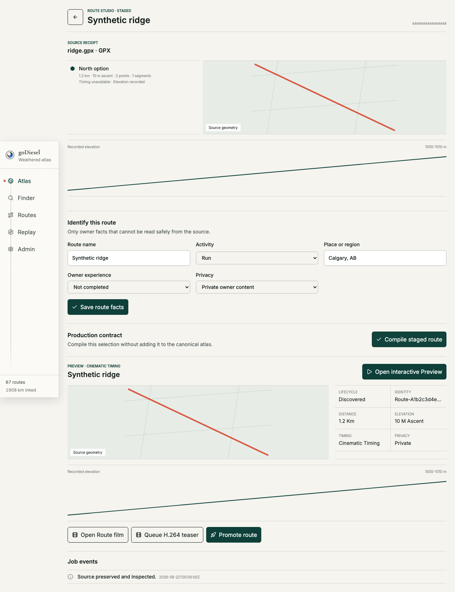
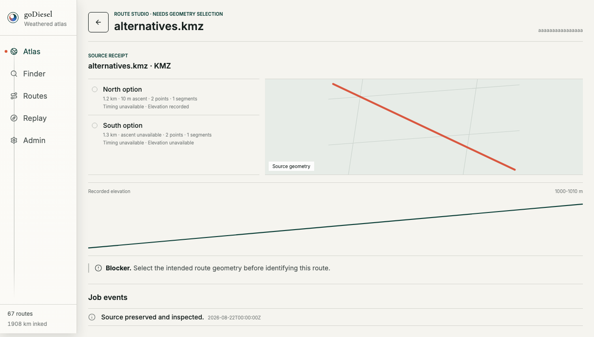

# Route Studio deterministic visual check

Date: 2026-08-22

## Scope

This check covers the owner-only source inspection, explicit geometry selection, metadata, strict staged compilation, and truthful Preview language in a provider-disabled deterministic browser.
It does not claim live Google 3D imagery or public film-export permission.

## Evidence

The staged route remains separate from canonical data, shows its source geometry and recorded elevation, and uses `Preview` with `Cinematic timing` because owner completion was not confirmed.

The KMZ inspection exposes both candidate geometries and blocks metadata until the owner explicitly selects one.

## Verification

`GODIESEL_CAPTURE_STUDIO_EVIDENCE=1 npx playwright test e2e/route-studio.spec.ts`

Seven journeys passed, including read-only Admin behavior, source-to-preview, ambiguity, Preview/Replay honesty, provider fallback, render retry, successful lifecycle-preserving promotion, and failed-promotion atlas preservation.
