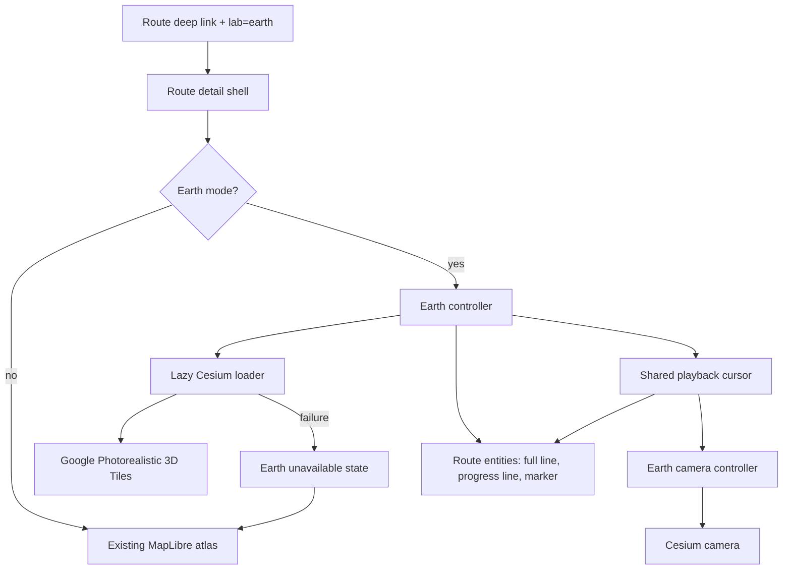
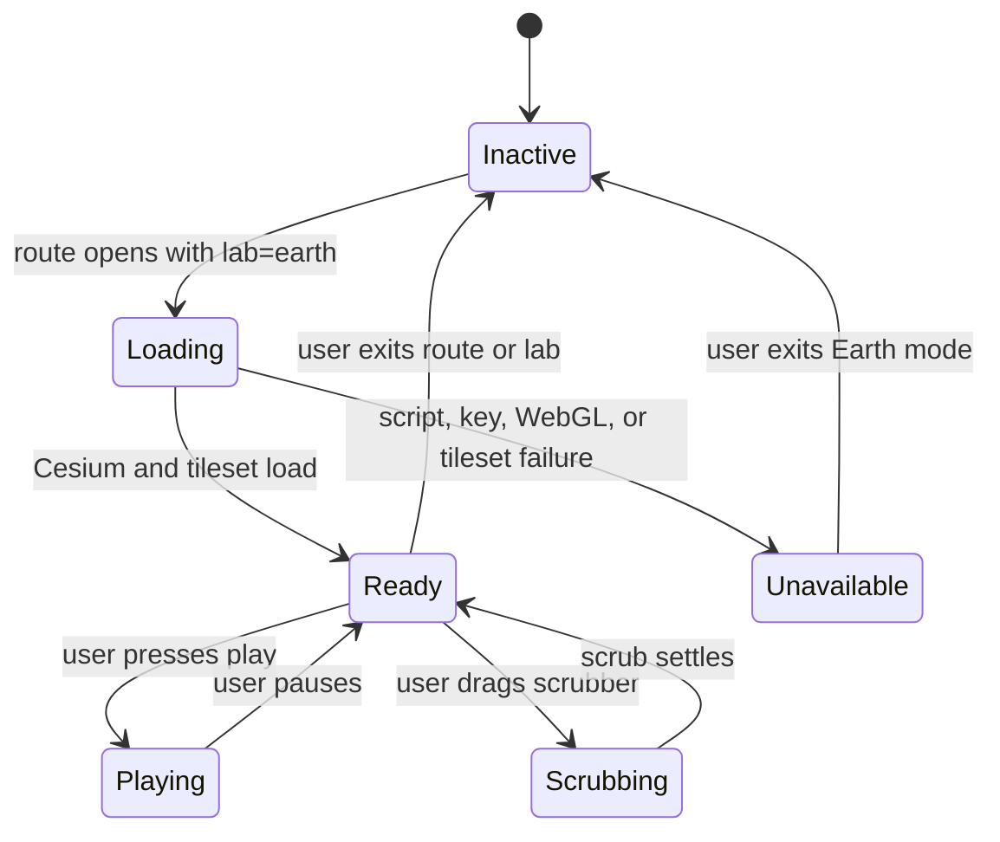

# feat: Add Earth Replay Lab

## Summary

Add an isolated `?lab=earth` route viewer that renders a selected quest route over Google Photorealistic 3D Tiles in CesiumJS. The first implementation should prove route playback, scrubbing, and camera follow in one continuous photorealistic world while preserving the current MapLibre atlas as the stable default.

---

## Problem Frame

The current route detail experience has strong playback foundations but still exposes multiple visual sources: MapLibre atlas, Street View route cam, and prior personal-photo surfaces. The Earth Replay Lab requirements define a narrower prototype: one photorealistic 3D world, one route layer, one playback model, and an honest fallback when the 3D world cannot load.

The spike in `docs/spikes/2026-06-13-google-earth-route-navigation.md` already verified that the local Google key can access the Photorealistic 3D Tiles root tileset. This plan turns that spike into an implementation path without replacing the working atlas.

---

## Requirements

**Earth World**

- R1. `?lab=earth#quest/13935098460` loads an Earth mode route detail without breaking the current gallery or standard atlas route detail.
- R2. Earth mode renders Google Photorealistic 3D Tiles as the primary visual surface.
- R3. Earth mode draws the full route and current progress over the 3D world.
- R4. Earth mode shows the current position marker in sync with route progress.

**Playback and Camera**

- R5. Play, pause, speed, and scrubber controls continue to drive the shared route cursor in Earth mode.
- R6. Playback moves the marker and camera along the route, not just the displayed distance.
- R7. Scrubbing updates the Earth route, marker, and camera to the matching route segment.
- R8. Camera movement prioritizes smoothness, orientation, and terrain legibility over dramatic cuts.

**Mode Boundaries and Fallbacks**

- R9. Earth mode is isolated behind the `earth` lab query and does not become the default route view.
- R10. Earth mode does not show personal-photo cards, map-cam fallback, or Street View as a competing default visual source.
- R11. If Cesium, the Google tileset, the API key, WebGL, or viewport support fails, the user sees an intentional unavailable state with a path back to the standard atlas.
- R12. Mobile may show a desktop-first prototype state instead of loading the full 3D world.

**Build and Deploy**

- R13. The generated `index.html` and deployable `dist/index.html` include the Earth lab only through the normal rebuild/package flow.
- R14. Documentation names the Google Map Tiles API requirement separately from the existing Google Maps JavaScript API Street View requirement.

---

## Key Technical Decisions

- KTD1. **Use CesiumJS for the prototype renderer:** Cesium gives the route camera and entity model needed for guided playback, while the current Google Maps JavaScript 3D APIs are still a less proven fit for custom route choreography.
- KTD2. **Load Cesium only for Earth mode:** The default atlas should not pay the Cesium runtime cost when `?lab=earth` is absent.
- KTD3. **Use the Google Map Tiles root tileset directly:** The spike proved the existing browser key can fetch `https://tile.googleapis.com/v1/3dtiles/root.json`, so the first pass should avoid adding Cesium ion as a separate account dependency.
- KTD4. **Reuse the existing route cursor contract:** `routePointAt`, `routeBearing`, play/pause, speed, and scrubber state should remain the source of truth for Earth progress.
- KTD5. **Treat Earth as a mode over the existing detail screen:** The detail header and bottom playback controls stay recognizable, while the map stage swaps to the Earth renderer when the lab is active.
- KTD6. **Fallback is a product state, not a console-only failure:** Errors from script loading, tileset loading, WebGL capability, or mobile gating should render a visible Earth-unavailable state.

---

## High-Level Technical Design

Earth Replay Lab adds a Cesium-backed renderer beside the existing MapLibre and route-cinema systems. The shared route cursor remains the coordination point.

The implementation should keep Earth-specific state separate from `map`, `routeCamPanorama`, and `cinemaRenderer`. The intended shape is a small Earth controller with viewer lifecycle, entity lifecycle, camera updates, and fallback handling.

---

## Implementation Units

### U1. Add Earth lab mode and stage shell

- **Goal:** Make `?lab=earth` a recognized route mode with a dedicated stage layer and visible experimental state.
- **Requirements:** R1, R9, R10, R13.
- **Dependencies:** None.
- **Files:** `build.py`, `test_static_ui.py`, `dist/index.html`.
- **Approach:** Extend lab parsing so `earth` enables Earth mode without appearing in dev-only prototype cycling unless intentionally exposed. Add Earth-specific DOM structure inside the existing route stage so the detail header and playback controls remain shared. Ensure Earth mode suppresses route-cam and cinema overlays as default visuals.
- **Patterns to follow:** Existing query parsing for `lab=atlas`, `syncRouteCinemaButton`, route detail stage markup, and generated static assertions in `test_static_ui.py`.
- **Test scenarios:**
  - Covers AE1. Static test asserts `earth` is recognized as a lab mode and does not require `devModes=1`.
  - Covers AE3. Static test asserts Earth mode does not render the Street View route cam as the primary Earth visual.
  - Static test asserts the Earth stage markup and unavailable-state copy are generated into `build.py`.
- **Verification:** Opening a route without `lab=earth` still shows the current atlas. Opening with `?lab=earth` shows the Earth lab shell or intentional unavailable state.

### U2. Add lazy Cesium and Google tileset loading

- **Goal:** Load CesiumJS and Google Photorealistic 3D Tiles only when Earth mode needs them.
- **Requirements:** R2, R11, R12, R13, R14.
- **Dependencies:** U1.
- **Files:** `build.py`, `README.md`, `test_static_ui.py`, `dist/index.html`.
- **Approach:** Add an Earth loader that injects Cesium assets only in Earth mode, checks for a Google key, gates unsupported mobile or WebGL contexts, and creates the tileset from the Google Map Tiles root URL. Keep loader state idempotent so route changes do not inject duplicate scripts.
- **Patterns to follow:** `loadGoogleMapsApi`, `initRouteCam`, `showMapFallback`, and current `.env` key injection.
- **Test scenarios:**
  - Covers AE1. Static test asserts Cesium assets are loaded through an Earth-specific loader, not global page scripts.
  - Covers AE4. Static test asserts missing Google key and load failure paths call the Earth unavailable state.
  - Static test asserts README documents Map Tiles API enablement and domain restrictions.
- **Verification:** Earth mode attempts Cesium loading only when `lab=earth` is active. With no Google key, the user sees the unavailable state instead of a blank canvas.

### U3. Render route entities in Earth mode

- **Goal:** Draw the full route, progress route, and marker in the photorealistic world.
- **Requirements:** R2, R3, R4, R10.
- **Dependencies:** U2.
- **Files:** `build.py`, `test_static_ui.py`, `dist/index.html`.
- **Approach:** Convert route points into Cesium Cartesian positions using longitude, latitude, and a small height offset. Maintain separate full-route and progress-route entities so `setRouteIndex` can update progress without rebuilding the full route. Keep the marker tied to `routePointAt` so interpolated scrubbing works.
- **Patterns to follow:** `routeFeature`, `pointFeature`, `updateMapSources`, `updateMainMapProgress`, and `routePointAt`.
- **Test scenarios:**
  - Covers AE1. Static test asserts Earth route entity creation includes full route, progress route, and marker concepts.
  - Covers AE2. Static test asserts Earth progress update is called from the shared route index update path.
  - Edge case: route with fewer than two points shows fallback rather than creating invalid Cesium entities.
- **Verification:** The canonical route is visible over the 3D world, and route progress changes as the scrubber moves.

### U4. Implement Earth camera follow and scrub sync

- **Goal:** Make Earth playback feel like a guided route preview with smooth camera movement.
- **Requirements:** R5, R6, R7, R8.
- **Dependencies:** U3.
- **Files:** `build.py`, `test_static_ui.py`, `dist/index.html`.
- **Approach:** Add an Earth camera controller that derives current point, lookahead point, heading, trailing offset, and camera height from the shared route cursor. Use the existing route playback loop as the clock; Earth mode should update from `setRouteIndex` so play, pause, speed, and scrubbing stay unified.
- **Technical design:** Directional guidance only: derive a current point and a lookahead point, place the camera behind and above the current point, and look toward the lookahead midpoint. Smooth bearing changes using the existing shortest-turn pattern from `smoothBearing`.
- **Patterns to follow:** `updateLockedRouteCamera`, `routeBearing`, `smoothBearing`, `startRoutePlayback`, `routePlaybackStep`, and `updateRouteCinema`.
- **Test scenarios:**
  - Covers AE2. Static test asserts Earth camera updates are connected to the route index update path.
  - Covers AE2. Browser verification checks a 30-second playback sample does not step segment-by-segment.
  - Edge case: pausing and scrubbing immediately after playback keeps the camera aligned with the scrubbed point.
- **Verification:** Play, pause, speed changes, and scrubber movement all update the Earth marker and camera without desynchronizing the displayed distance.

### U5. Add Earth fallback, exit, and responsive behavior

- **Goal:** Make unavailable or unsuitable Earth mode understandable and reversible.
- **Requirements:** R11, R12, R14.
- **Dependencies:** U1, U2.
- **Files:** `build.py`, `test_static_ui.py`, `dist/index.html`.
- **Approach:** Add visible states for loading, unavailable, and desktop-first fallback. Provide a route back to the standard atlas without requiring the user to edit the URL manually. Keep the failure language specific enough to distinguish missing key, unsupported device, and tileset load failure where the app can know the cause.
- **Patterns to follow:** `showMapFallback`, `setRouteCamMode`, `syncRouteCinemaButton`, and current mobile route-cam CSS regression coverage.
- **Test scenarios:**
  - Covers AE4. Static test asserts fallback copy and standard-atlas exit action exist.
  - Covers AE4. Static test asserts a desktop-first mobile branch exists for Earth mode.
  - Error path: simulated loader failure displays unavailable state and leaves route navigation usable.
- **Verification:** For missing key or forced loader failure, the page shows a clear fallback and a path to the standard atlas.

### U6. Regenerate, document, and browser-verify the prototype

- **Goal:** Package the generated app and add enough verification to safely hand off the Earth lab prototype.
- **Requirements:** R1, R5, R8, R13, R14.
- **Dependencies:** U1, U2, U3, U4, U5.
- **Files:** `build.py`, `README.md`, `test_static_ui.py`, `dist/index.html`, `docs/spikes/2026-06-13-google-earth-route-navigation.md`.
- **Approach:** Regenerate `index.html` and `dist/index.html` through the existing build scripts. Update documentation with Map Tiles API requirements and the Earth lab test URL. Add or extend static tests for mode wiring and fallback paths, then perform browser verification against the canonical route.
- **Execution note:** Browser verification is required because the primary value is visual, animated, and WebGL-based.
- **Patterns to follow:** Current `rebuild.sh`, `make-dist.sh`, and dogfood report verification style in `docs/dogfood-reports/2026-06-13-clanker-quest-atlas-dogfood.md`.
- **Test scenarios:**
  - Covers AE1. Open `?lab=earth#quest/13935098460` and confirm Earth world or intentional fallback renders without console errors.
  - Covers AE2. Play for 30 seconds and verify the marker, displayed distance, and camera move together.
  - Covers AE2. Drag the scrubber to start, middle, and near-finish and verify the Earth view updates each time.
  - Covers AE3. Confirm Earth mode does not switch to personal photos, Street View, or map-cam as the default route visual.
  - Covers AE4. Run missing-key or forced-loader fallback and confirm the page remains navigable.
- **Verification:** Existing Python tests pass, generated `dist/index.html` contains the Earth mode, browser console has no route-breaking errors during the canonical playback sample, and screenshots show a nonblank Earth stage or intentional fallback.

---

## Scope Boundaries

Deferred for later:

- Street View windshield moments inside Earth mode.
- Route trailer or shareable video export.
- Mobile-first Earth playback.
- Full replacement of the current MapLibre atlas.
- Quest gameplay effects beyond a route layer and current-position marker.

Outside this product's identity for this pass:

- AI-generated fake terrain or invented route imagery.
- A general-purpose Google Earth clone.
- A route viewer that prioritizes cinematic spectacle over route truth.
- Any approach that presents a map inset or terrain crop as photorealistic ground imagery.

---

## System-Wide Impact

Earth Replay Lab increases the app's external API surface. The existing Google Maps JavaScript key requirement remains for Street View, but Earth mode also depends on Google Map Tiles API access and billing. It also adds a heavier WebGL runtime, so the default atlas path must remain unaffected for users who do not opt into Earth mode.

The generated static app remains the deployment artifact. Changes should flow through `build.py`, then into `index.html` and `dist/index.html` via the existing rebuild/package scripts.

---

## Risks and Dependencies

- **Google key and billing:** Earth mode depends on Map Tiles API enablement, browser key restrictions, and quota behavior. Mitigation: fail visibly when unavailable and document the API requirement.
- **Performance:** Photorealistic tiles are GPU-heavy. Mitigation: desktop-first gate and lazy-load Cesium only in Earth mode.
- **Camera nausea or clipping:** Aggressive camera motion can make route playback feel worse. Mitigation: start with conservative height, pitch, and smoothing values and verify with the canonical route.
- **Static app complexity:** `build.py` is already large. Mitigation: keep Earth-specific state namespaced and avoid refactoring unrelated atlas behavior in the first pass.
- **External API drift:** Google 3D Maps and Map Tiles APIs are active surfaces. Mitigation: cite official docs in implementation and keep fallback behavior product-quality.

---

## Documentation and Operational Notes

- Update `README.md` to distinguish Maps JavaScript API for Street View from Map Tiles API for Earth mode.
- Keep `docs/spikes/2026-06-13-google-earth-route-navigation.md` as the research record; append only if implementation discovers a material correction.
- Production deploy requires Google Cloud website restrictions for the local and Cloudflare Pages domains.
- Any future dogfood report should test default atlas, Earth deep link, playback, scrub, fallback, and mobile behavior.

---

## Sources and Research

- `docs/brainstorms/2026-06-13-earth-replay-lab-requirements.md`
- `docs/ideation/2026-06-13-google-earth-route-world-ideation.html`
- `docs/spikes/2026-06-13-google-earth-route-navigation.md`
- `docs/dogfood-reports/2026-06-13-clanker-quest-atlas-dogfood.md`
- `build.py`
- `test_static_ui.py`
- Google Maps Platform: Photorealistic 3D Tiles - `https://developers.google.com/maps/documentation/tile/3d-tiles`
- Google Maps JavaScript API: 3D Maps overview - `https://developers.google.com/maps/documentation/javascript/3d/overview`
- CesiumJS guide: Photorealistic 3D Tiles from Google Maps Platform - `https://cesium.com/learn/cesiumjs-learn/cesiumjs-photorealistic-3d-tiles/`
