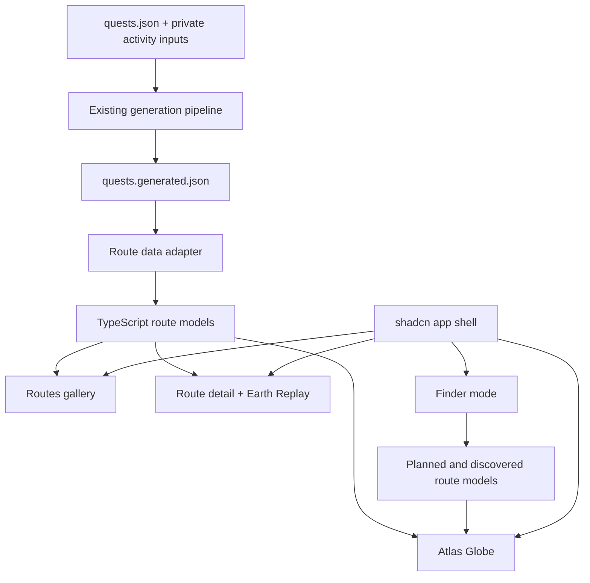
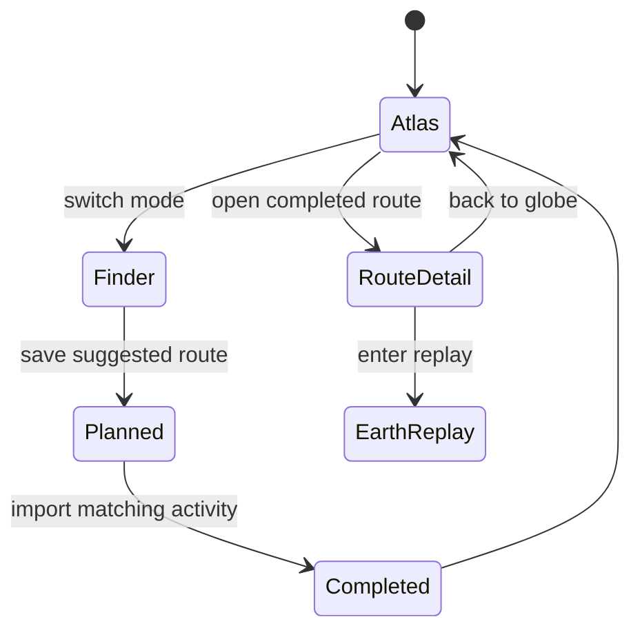

# feat: Migrate goDiesel to React app shell

## Summary

Create a React, TypeScript, Tailwind, and shadcn/ui application shell for goDiesel with Globe as the default home, `Atlas` as memory mode, and `Finder` as route-planning mode. Keep the current static app runnable until the React app reaches parity for Globe, route gallery, route detail, and Earth Replay.

---

## Problem Frame

The current app is a successful prototype, but the product surface has outgrown generated HTML in `build.py`. The next work should establish a component-based app foundation before adding more navigation, search, planning, and route lifecycle behavior.

The migration must preserve what already works: generated route data, current quest metadata, all-routes browsing, route detail, and Earth Replay. The first milestone should create a maintainable app structure without forcing a backend or re-solving route playback.

---

## Requirements

**Foundation**

- R1. The repo contains a configured React, TypeScript, Tailwind, and shadcn/ui app for the quest atlas.
- R2. The new app can run locally without breaking the existing static app build.
- R3. The shadcn CLI recognizes the new app through `components.json`.
- R4. The app can add shadcn registry components through standard CLI commands.

**App Shell**

- R5. The default app route opens the Globe home.
- R6. Primary navigation includes `Atlas`, `Finder`, `Routes`, `Replay`, and `Admin`.
- R7. `Atlas` and `Finder` are separate top-level modes with distinct copy and route states.
- R8. Direct route links remain possible for completed routes.
- R17. `Replay` and `Admin` navigation have defined first-milestone behavior, even when their full destination is not ported.
- R18. The app shell defines desktop, tablet, and mobile navigation behavior before implementation.

**Route Data and Lifecycle**

- R9. The new app consumes existing route data before introducing a backend.
- R10. TypeScript models represent completed, planned, and discovered route states.
- R11. Completed route heat/traces are visually distinct from planned and discovered routes.
- R12. Route data migration does not change source route semantics.
- R19. React route data comes from a generated artifact containing geometry, distance, elevation, region, replay metadata, and lifecycle state.

**Parity**

- R13. The route gallery remains available as `Routes`.
- R14. Completed route detail remains available from Globe and Routes.
- R15. Earth Replay remains available for completed route detail.
- R16. The current static app remains buildable until React parity is reached.
- R20. Route detail and Earth Replay preserve the current hash-link strategy during parity unless a later cutover plan adds deployment fallback routing.
- R21. Earth Replay has explicit viewer lifecycle, cleanup, and route-to-route reset behavior.

**Search and Finder**

- R22. Atlas search defines initial, typing, loading, grouped results, no-results, selected-result, and unsupported-query states.
- R23. Finder search defines discovered, planned, saved-success, no-results, and unsupported-query states without implying real recommendations.
- R24. Planned route lifecycle UI defines where saved plans live, how they reopen, and how completion/import is represented while backend work is deferred.

---

## Origin Coverage

Plan R-IDs are local to this implementation plan. Origin requirements from `docs/brainstorms/2026-06-21-godiesel-react-migration-requirements.md` are covered as follows:

| Origin requirement | Covered by |
|---|---|
| Origin R1. App opens to Globe | Plan R5, U4 |
| Origin R2. Persistent primary navigation | Plan R6, R17, R18, U2 |
| Origin R3. Direct route links | Plan R8, R20, U5 |
| Origin R4. Path back to all routes | Plan R13, R14, U5, U6 |
| Origin R5. Completed route heat/traces | Plan R11, U4 |
| Origin R6. Atlas memory search | Plan R22, U4 |
| Origin R7. Completed route opens detail/replay | Plan R14, R15, U5, U6 |
| Origin R8. Completed vs planned/discovered distinction | Plan R10, R11, R23, U3, U7 |
| Origin R9. Finder top-level mode | Plan R6, R7, U7 |
| Origin R10. Finder search | Plan R23, U7 |
| Origin R11. Suggested vs planned results | Plan R10, R23, U7 |
| Origin R12. Save suggested as planned | Plan R24, U7 |
| Origin R13. Route lifecycle | Plan R10, R24, U3, U7 |
| Origin R14. Completed routes grounded in activity data | Plan R19, U3 |
| Origin R15. Planned/discovered do not imply completion | Plan R11, R23, U7 |
| Origin R16. Future imports promote planned routes | Plan R24, U7 |
| Origin R17. Configured shadcn project | Plan R1, R3, R4, U1, U2 |
| Origin R18. TypeScript domain types | Plan R10, U3 |
| Origin R19. Existing generated route data first | Plan R9, R19, U3 |
| Origin R20. Earth Replay remains available | Plan R15, R21, U6 |

---

## Key Technical Decisions

- KTD1. **Use a sibling React app surface first:** Add the React app in a dedicated app directory so the existing generated `index.html` and `dist/` deploy flow remain intact while parity is developed.
- KTD2. **Use Vite for the first migration target:** The app is primarily client-side WebGL, map, animation, and route-state work, so Vite keeps the framework surface smaller than Next.js for this phase.
- KTD3. **Adopt shadcn after initialization, not before:** Run shadcn inside the new app where `components.json`, Tailwind, aliases, and TypeScript exist; do not install registry blocks into the repo root.
- KTD4. **Extract data contracts before visual ports:** Route data, lifecycle state, replay mode, and region grouping types should exist before porting Globe or Earth components.
- KTD5. **Port Earth Replay as parity, not redesign:** Earth Replay should move behind a React route detail component with the same behavioral expectations captured in the existing Earth Replay plan.
- KTD6. **Defer backend and Strava OAuth:** The first migration should consume static route data and model future planned/discovered states without implementing external route search or imports.
- KTD7. **Preserve hash route links during parity:** Keep the current `#quest/:id` deep-link shape for the React parity milestone so shared route URLs and refresh behavior do not depend on Cloudflare SPA fallback work.
- KTD8. **Generate React route data from the existing pipeline:** Treat `quests.json` as curation input, not replay data. Extend the current generation pipeline to emit the React route artifact from the same private activity inputs used by `build.py`.
- KTD9. **Add shadcn components by first consumer:** Initialize shadcn once, then add only the components required by the current implementation unit instead of installing a broad `components/ui/*` surface ahead of use.

---

## High-Level Technical Design

The migration creates a React app that coexists with the current static generator. The static app continues to generate `index.html` and `dist/`; the React app becomes the next product surface and can later replace the static deploy target once parity is proven.

The target navigation model separates memory and planning without creating separate products.

---

## Implementation Units

### U1. Scaffold the React application foundation

- **Goal:** Add a Vite React TypeScript app that can run beside the current static prototype.
- **Requirements:** R1, R2, R3, R4, R16, R20.
- **Files:** `app/package.json`, `app/vite.config.ts`, `app/tsconfig.json`, `app/index.html`, `app/src/main.tsx`, `app/src/App.tsx`, `app/src/index.css`, `app/components.json`.
- **Patterns:** Follow the existing `lottie-player` Vite app only for local toolchain shape; do not mix quest atlas code into `lottie-player`.
- **Test Scenarios:**
  - The app installs and starts from `app/`.
  - `npx shadcn@latest info --json` run inside `app/` detects a configured project.
  - The existing `./rebuild.sh` and `./make-dist.sh` still work for the static app.
  - The React router supports current `#quest/:id` links without Cloudflare fallback routing.
- **Verification:** Run the React dev server and confirm the first shell renders; run existing Python tests for static app coverage.

### U2. Install shadcn base components and app shell primitives

- **Goal:** Establish the minimum shadcn baseline needed by the app shell and first navigable routes.
- **Requirements:** R3, R4, R5, R6, R7, R17, R18.
- **Files:** `app/components.json`, `app/src/components/ui/button.tsx`, `app/src/components/ui/sidebar.tsx`, `app/src/components/app-sidebar.tsx`, `app/src/components/app-shell.tsx`, `app/src/lib/utils.ts`.
- **Patterns:** Use shadcn CLI from inside `app/`; review generated files after installation; use semantic tokens and component composition rather than custom-styled divs. Add components incrementally by first consumer, beginning with sidebar/navigation/button primitives and deferring command, card, tooltip, or dialog components until the unit that needs them.
- **Test Scenarios:**
  - Sidebar navigation renders `Atlas`, `Finder`, `Routes`, `Replay`, and `Admin`.
  - `Replay` opens a replay route picker or disabled empty state until a route is selected.
  - `Admin` either links to the existing local admin surface or renders an explicit unavailable/coming-soon state.
  - Desktop uses a persistent sidebar; tablet uses a collapsible rail or sheet; mobile uses a bottom or sheet navigation pattern with visible active state.
  - Keyboard focus moves through sidebar controls in a sensible order.
  - shadcn components import through the configured alias.
- **Verification:** Browser check at desktop, tablet, and mobile widths; confirm no text overlap, touch targets remain usable, and users can escape route detail/replay back to Atlas or Routes.

### U3. Create route data adapter and lifecycle models

- **Goal:** Move the route domain into TypeScript types and data loaders without changing current route meaning.
- **Requirements:** R9, R10, R11, R12, R19.
- **Files:** `build.py`, `app/src/domain/routes.ts`, `app/src/domain/route-lifecycle.ts`, `app/src/data/routes.ts`, `app/src/data/route-regions.ts`, `app/src/data/quests.generated.json`.
- **Patterns:** Treat `quests.json` as curation input only. Extend the existing Python generation flow to emit `app/src/data/quests.generated.json` with the same route payload needed for Globe and Replay: activity ID, status, region, type, distance, elevation, date, title, description, route points, elevation/profile samples, replay metadata, and lifecycle state.
- **Test Scenarios:**
  - Completed routes load with distance, elevation, type, region, route points, and replay metadata.
  - Planned and discovered route states can be represented without being counted as completed heat.
  - Invalid or missing route geometry fails with a typed fallback state rather than breaking the app shell.
  - Generated React route data count and representative route geometry match the current static `ROUTES` payload.
- **Verification:** Add TypeScript or unit tests for route adapters; compare route counts and a representative route point sample against the current static app.

### U4. Port Atlas Globe as the default home

- **Goal:** Make the Globe the React app's default route and preserve route heat/traces for completed routes.
- **Requirements:** R5, R7, R8, R11, R22.
- **Files:** `app/src/pages/atlas-page.tsx`, `app/src/components/globe/atlas-globe.tsx`, `app/src/components/globe/region-panel.tsx`, `app/src/components/search/atlas-search.tsx`.
- **Patterns:** Preserve the current Three.js globe intent: route heat/traces over dots, region selection, label occlusion, and globe interaction. Atlas search should include initial, typing, loading, grouped-results, no-results, selected-result, and unsupported-query states.
- **Test Scenarios:**
  - Opening the app root renders the Atlas globe.
  - Completed route traces appear on the globe.
  - Selecting a region shows its completed routes.
  - Atlas search groups completed routes, regions, and replay-worthy memories.
  - Atlas search no-results and unsupported-query states do not look like Finder suggestions.
  - Opening a completed route navigates to route detail.
- **Verification:** Browser screenshot verifies a nonblank globe, visible route traces, usable labels, and working region selection.

### U5. Port Routes gallery and route detail shell

- **Goal:** Preserve all-routes browsing and completed route detail in the React app.
- **Requirements:** R8, R13, R14, R16, R20.
- **Files:** `app/src/pages/routes-page.tsx`, `app/src/pages/route-detail-page.tsx`, `app/src/components/routes/route-card.tsx`, `app/src/components/routes/route-summary.tsx`, `app/src/router.tsx`.
- **Patterns:** Keep the current card gallery as `Routes`, not as the landing screen; preserve route deep links using the current `#quest/:id` strategy during parity.
- **Test Scenarios:**
  - Routes page lists completed routes with filters or search sufficient for parity.
  - Route card opens route detail.
  - Unknown route ID shows an intentional not-found state.
  - Navigation back to Atlas and Routes works from route detail.
- **Verification:** Browser check route open/back flows for representative routes.

### U6. Port Earth Replay into the React route detail

- **Goal:** Keep Earth Replay available for completed routes in the new app without changing its product behavior.
- **Requirements:** R14, R15, R16, R17, R21.
- **Files:** `app/src/components/replay/earth-replay.tsx`, `app/src/components/replay/replay-controls.tsx`, `app/src/components/replay/avatar-picker.tsx`, `app/src/domain/replay.ts`, `app/src/lib/earth-replay-controller.ts`.
- **Patterns:** Preserve expectations from `docs/plans/2026-06-13-001-feat-earth-replay-lab-plan.md`: photorealistic 3D tiles, route thread/progress, smooth camera behavior, visible fallback state, and route cursor synchronization. Keep imperative Cesium viewer ownership behind a controller boundary with explicit cleanup on unmount, route change, and replay exit.
- **Test Scenarios:**
  - A completed route can enter Earth Replay.
  - Top-level `Replay` opens a route picker or the latest selected completed route without dead-ending.
  - Playback, pause, speed, and scrub update marker, route thread, and camera.
  - Tile/API failures show a legible fallback.
  - Animated avatar selection persists in local state.
  - Opening one route, leaving replay, opening a second route, and re-entering replay does not duplicate Cesium viewers, listeners, or stale route state.
- **Verification:** Browser verification with a scenic route and a city route; canvas is nonblank, route thread visible, controls usable, and route-to-route navigation cleans up the prior replay instance.

### U7. Add Finder mode as a separate planning surface

- **Goal:** Add a future-route planning mode after completed-route parity proves the shared route data model.
- **Requirements:** R6, R7, R10, R11, R12, R23, R24.
- **Files:** `app/src/pages/finder-page.tsx`, `app/src/components/search/finder-search.tsx`, `app/src/components/routes/planned-route-card.tsx`, `app/src/domain/finder.ts`.
- **Patterns:** Implement local/mock planning data after Routes and Earth Replay parity. Make Finder visibly non-authoritative until real route recommendation or import exists; planned/discovered states must not look like completed route heat.
- **Test Scenarios:**
  - Finder mode is reachable from sidebar navigation.
  - Finder search has initial, typing, grouped-results, no-results, unsupported-query, saved-success, and selected-result states.
  - Finder search returns planned/discovered placeholders distinct from completed routes.
  - Saving a discovered route creates a planned state in local app state and shows where that planned route now lives.
  - Planned routes do not appear as completed heat.
  - Planned-to-completed promotion is represented as unavailable or pending while backend and Strava work are deferred.
- **Verification:** Browser check confirms the mental model: Atlas is past, Finder is future.

### U8. Document migration workflow and parity gates

- **Goal:** Make the new app runnable and keep the old app's role clear until cutover.
- **Requirements:** R2, R16, R19, R20.
- **Files:** `README.md`, `docs/plans/2026-06-21-feat-godiesel-react-migration-plan.md`, `app/README.md`.
- **Patterns:** Document commands separately for static prototype and React app.
- **Test Scenarios:**
  - README explains how to run the React app.
  - README explains how to keep generating the current static deploy.
  - README explains how to regenerate React route data from the existing pipeline.
  - README states that parity uses hash route links and that browser-history URLs require a later Cloudflare fallback/cutover plan.
  - Parity checklist names Atlas, Finder, Routes, route detail, and Earth Replay.
- **Verification:** A fresh terminal can run both surfaces from documented commands.

---

## Scope Boundaries

Deferred for later:

- Production backend persistence.
- Strava OAuth and historical import.
- Real route recommendation APIs.
- Route export to watches or navigation devices.
- Cloudflare deployment cutover from static `dist/` to the React build.

Outside this migration:

- Rewriting Earth Replay product behavior before parity.
- Moving quest curation out of the existing local admin flow.
- Making Finder imply that suggested routes are completed activity.
- Adding registry blocks into the unconfigured repo root.

---

## Risks & Dependencies

- **Cesium and Google tiles in React:** Earth Replay may need careful lifecycle cleanup to avoid memory leaks or duplicated viewers.
- **shadcn registry drift:** Registry components should be added through the CLI and reviewed after installation because generated code can still need project-specific fixes.
- **Data duplication during migration:** Copying generated route data into the React app is acceptable for the first milestone but should not become an untracked manual process.
- **Two app surfaces:** Running static and React surfaces side by side reduces cutover risk but increases short-term maintenance.
- **Generated route artifact:** `quests.json` is not sufficient for Globe or Replay parity. React route data must come from the existing route-generation pipeline or an equivalent generated artifact.
- **Routing compatibility:** The parity milestone preserves hash links. Browser-history URLs and Cloudflare fallback routing require a later cutover plan.
- **Finder realism:** Finder placeholders must remain visually distinct from real completed activity until route recommendation, GPX, or Strava import exists.

---

## Documentation / Operational Notes

The first implementation pass should document separate commands for the static prototype and the React app. It should also document the generated route-data command and the hash-link parity decision. Do not replace `dist/` deployment until React parity is verified for the Globe default, route gallery, route detail, and Earth Replay.

---

## Sources / Research

- `docs/brainstorms/2026-06-21-godiesel-react-migration-requirements.md` defines the product shape: Globe default, `Atlas` for memories, `Finder` for planning.
- `README.md` describes the current static app, generated deploy folder, route curation, and API-key requirements.
- `docs/plans/2026-06-13-001-feat-earth-replay-lab-plan.md` defines the Earth Replay behavior that must be preserved.
- `test_static_ui.py` captures current UI contracts for Globe, Earth Replay, avatars, route heat, and navigation.
- `lottie-player/` is an existing Vite app in the repo and can inform tooling shape, but it is not the quest atlas app.
