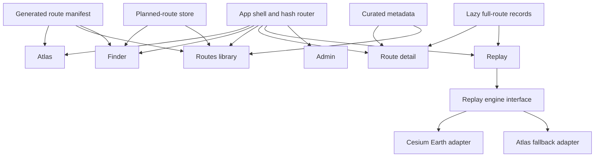
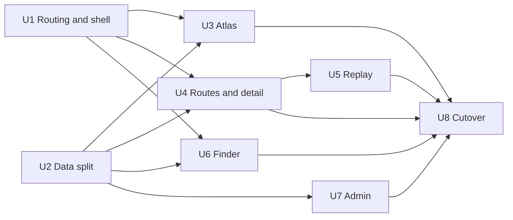

# Globe-First Structural Implementation Plan

## Summary

Turn the current React migration shell into the real goDiesel application.

The globe becomes the default home and primary navigation surface.

Atlas owns completed route memories, Finder owns future route planning, Routes provides a searchable library, and Replay preserves the existing Earth experience behind a maintainable React boundary.

This plan builds on the working React shell, generated route adapter, Three.js globe, route traces, region selection, and Atlas search already present in `app/`.

It does not restart the project or redesign Earth Replay before parity.

## Product Outcome

The first complete product loop is:

1. Open goDiesel into a full-bleed globe of completed routes.
2. Search or explore a region and open a completed route.
3. Understand the route through curated experiential context.
4. Enter an immersive replay without losing navigation context.
5. Use Finder to save a future route as planned.
6. Keep planned routes separate until real activity data promotes them to completed memories.

## Current Baseline

The following foundations already exist and should be retained:

- Vite, React, TypeScript, Tailwind, and shadcn-compatible configuration under `app/`.
- A persistent desktop sidebar and mobile navigation.
- Atlas, Finder, Routes, Replay, and Admin first-milestone surfaces.
- A Three.js globe with completed route traces, globe rotation, zoom, labels, and region selection.
- Atlas memory search with explicit unsupported planning-query behavior.
- Generated route data for 66 completed routes.
- Typed completed, planned, and discovered lifecycle states.
- Legacy `#quest/:slug` deep-link handling.
- A proven static Earth Replay implementation in `build.py` with Cesium, Google Photorealistic 3D Tiles, route progress, camera behavior, failure states, and Lottie avatars.

The current React app is not yet product-complete because Routes and Replay are placeholders, Finder has no real planning lifecycle, navigation state is hand-written, all route geometry ships in one initial payload, and the static prototype remains the only complete replay implementation.

## Scope

### In Scope

- Globe as the real default application page.
- Persistent responsive navigation across all product surfaces.
- Completed route traces and region density on the globe.
- Searchable completed-route library and route detail pages.
- Curated route context including vibe, terrain, difficulty, highlights, caveats, and ideal use.
- Earth Replay parity inside the React app.
- Finder as a separate future-route planning surface.
- Local persistence for planned routes until a backend is justified.
- A deliberate shadcn component baseline.
- Build, test, browser QA, and deploy cutover documentation.

### Out of Scope

- Social feeds and leaderboards.
- Travel booking and logistics.
- Native mobile or background GPS tracking.
- Public route submissions or a creator marketplace.
- Broad community features.
- Strava OAuth and automatic activity import.
- Production multi-user persistence.
- Replacing Earth Replay with a new replay concept during migration.

## Information Architecture

Use hash routing for the first production cutover so Cloudflare Pages can serve direct links without fallback routing changes.

Legacy `#quest/:slug` links should redirect to the canonical route detail URL.

| URL | Surface | Responsibility |
| --- | --- | --- |
| `#/atlas` | Atlas | Default globe, memory search, region exploration |
| `#/finder` | Finder | Search and plan future routes |
| `#/routes` | Routes | Filterable completed and planned route library |
| `#/routes/:slug` | Route detail | Curated guide for one route |
| `#/replay/:slug` | Replay | Immersive Earth or Atlas replay |
| `#/admin` | Admin | Owner curation workflow and data status |
| `#quest/:slug` | Legacy redirect | Preserve existing shared links |

The sidebar is persistent on desktop, collapsible at intermediate widths, and becomes a shadcn Sheet on mobile.

The mobile shell must not place navigation controls over replay controls or route content.

## Application Architecture



## Route Data Architecture

Split the current 3.4 MB generated route artifact into a lightweight manifest and lazy full-route files.

The application should not parse every full-resolution route and replay payload before rendering the home globe.

### Route Manifest

`app/src/data/generated/routes.manifest.json` contains data needed by Atlas, Finder comparisons, and the Routes library:

- Stable route ID and slug.
- Lifecycle state.
- Name, region, date, and activity type.
- Distance and elevation gain.
- Center point and bounding box.
- Simplified globe trace.
- Curation summary and vibe tags.
- Replay eligibility and replay quality.

### Full Route Record

`app/public/data/routes/:slug.json` contains data loaded only for route detail or replay:

- Full route geometry with distance and elevation samples.
- Replay metadata.
- Elevation profile.
- Complete editorial fields.
- Source activity references.
- Visual and provider availability metadata.

### Domain Model

Use a discriminated union rather than one permissive route object:

```ts
type RouteRecord = CompletedRoute | PlannedRoute | DiscoveredRoute;

interface CompletedRoute extends RouteBase {
  lifecycle: "completed";
  activityId: string;
  completedAt: string;
  replay: ReplayMetadata;
}

interface PlannedRoute extends RouteBase {
  lifecycle: "planned";
  plannedFor?: string;
  source: PlanningSource;
}

interface DiscoveredRoute extends RouteBase {
  lifecycle: "discovered";
  source: DiscoverySource;
}
```

Only completed routes may contribute to Atlas heat, completed distance totals, or replay history.

## Curation Model

Route curation is a first-class product capability, not presentation copy embedded in components.

Each curated route should support:

- `vibe`: a short experiential summary.
- `bestFor`: the kind of day or intention the route suits.
- `terrain`: surface and terrain descriptors.
- `difficulty`: a human judgment supported by route statistics.
- `highlights`: memorable places or route moments.
- `caveats`: navigation, safety, access, weather, or logistics concerns.
- `seasonality`: when the route is best or unavailable.
- `editorialNote`: why the route is worth preserving or doing.
- `curationStatus`: draft, reviewed, or published.

The generated data pipeline should validate these fields and allow incomplete drafts without presenting missing fields as finished recommendations.

## Replay Boundary

React owns route selection, navigation, playback state, selected avatar, error presentation, and cleanup.

An imperative replay controller owns the Cesium viewer and external rendering APIs.

```ts
interface ReplayEngine {
  mount(container: HTMLElement, route: CompletedRouteDetail): Promise<void>;
  play(): void;
  pause(): void;
  seek(progress: number): void;
  setSpeed(speed: ReplaySpeed): void;
  setFollowing(following: boolean): void;
  resize(): void;
  destroy(): void;
}
```

The Cesium adapter must destroy viewers, event listeners, animation frames, and tile resources when the route changes or Replay unmounts.

Earth Replay should use the npm-managed Cesium package and Vite asset configuration rather than injecting a versioned CDN script at runtime.

The Google Maps browser key remains browser-restricted and is supplied through `VITE_GOOGLE_MAPS_API_KEY`.

## Implementation Sequence

### U1. Establish Canonical Routing and App Shell

**Goal:** Replace hand-written view state with URL-addressable application routes and make the globe the stable default.

**Changes:**

- Add `react-router-dom` with `HashRouter`.
- Create a route configuration and nested app layout.
- Redirect an empty hash to `#/atlas`.
- Redirect legacy `#quest/:slug` links to `#/routes/:slug`.
- Replace placeholder navigation state with route-aware active states.
- Replace the migration-preview header with product-level context or remove it where the globe should be full-bleed.
- Use the official shadcn Sidebar composition and Sheet for responsive navigation.

**Primary files:**

- `app/src/router.tsx`
- `app/src/components/layout/app-layout.tsx`
- `app/src/components/layout/app-sidebar.tsx`
- `app/src/components/layout/mobile-navigation.tsx`
- `app/src/App.tsx`

**Acceptance:**

- Root load opens Atlas.
- Browser back and forward restore the correct page and selected route.
- Every sidebar item has a canonical URL and active state.
- A route detail or replay always has a visible path back to Atlas and Routes.
- Desktop, tablet, and mobile navigation do not overlap content.

### U2. Split and Validate Generated Route Data

**Goal:** Make the home globe fast and give route detail and replay a reliable typed data contract.

**Changes:**

- Extend `build.py` to emit the manifest and one full file per route.
- Add route curation fields to the generation contract.
- Add runtime validation at the generated-data boundary.
- Replace `raw` route payload access with typed fields.
- Add `loadRouteDetail(slug)` with loading, missing, and invalid-data states.
- Preserve static prototype generation until the React cutover gate passes.

**Primary files:**

- `build.py`
- `quest_meta.py`
- `app/src/domain/route.ts`
- `app/src/data/route-repository.ts`
- `app/src/data/generated/routes.manifest.json`
- `app/public/data/routes/*.json`

**Acceptance:**

- Atlas renders from the manifest without loading full route records.
- Route detail lazily loads the selected full record.
- Generated route counts and representative geometry match the source data.
- Invalid geometry disables replay for one route without crashing the application.
- Planned and discovered records cannot be counted as completed routes.

### U3. Productize the Globe-First Atlas

**Goal:** Make Atlas feel like the primary product instead of a dashboard section containing a globe.

**Changes:**

- Make the Three.js scene full-bleed within the application workspace.
- Keep navigation and search as restrained overlays outside the globe's pointer-critical center.
- Render simplified completed route traces with density expressed through intensity, not marker size.
- Preserve landmass context, front/back occlusion, label collision handling, drag, zoom, and keyboard-accessible route alternatives.
- Replace the permanently visible region column with a selected-region drawer or inspector.
- Synchronize globe selection, search selection, URL query state, and region inspector state.

**Primary files:**

- `app/src/pages/atlas-page.tsx`
- `app/src/components/globe/atlas-globe.tsx`
- `app/src/components/globe/atlas-controls.tsx`
- `app/src/components/globe/region-inspector.tsx`
- `app/src/components/search/atlas-search.tsx`

**Acceptance:**

- The globe is visible and useful in the first viewport at desktop and mobile sizes.
- Route traces remain visible on land and do not become giant density orbs.
- Selecting a region reveals routes without trapping the user in that region.
- Clear selection returns to the full atlas.
- Mouse, touch, wheel, and keyboard alternatives all work.
- Canvas pixel checks confirm a nonblank and changing scene.

### U4. Build the Routes Library and Curated Route Detail

**Goal:** Turn raw activity records into understandable route guides.

**Changes:**

- Build a full Routes page with search, lifecycle, activity type, region, distance, climb, and vibe filters.
- Create route cards that communicate the route's experience rather than only statistics.
- Create a route detail page with overview, route map, elevation, vibe, terrain, highlights, caveats, seasonality, and source activity context.
- Add an explicit Replay action only when replay data is valid.
- Add intentional loading, invalid route, missing geometry, and not-found states.

**Primary files:**

- `app/src/pages/routes-page.tsx`
- `app/src/pages/route-detail-page.tsx`
- `app/src/components/routes/route-card.tsx`
- `app/src/components/routes/route-filters.tsx`
- `app/src/components/routes/route-guide.tsx`
- `app/src/components/routes/elevation-profile.tsx`

**Acceptance:**

- A route can be opened from Atlas, search, or Routes and resolves to the same canonical detail page.
- The page answers what the route feels like, who or what day it suits, and what to watch for.
- Missing editorial fields are omitted or marked draft rather than fabricated.
- Shared route detail URLs work after refresh on the static deployment.

### U5. Port Earth Replay Behind the Replay Engine

**Goal:** Reach behavioral parity with the static Earth Replay without changing its direction.

**Changes:**

- Install and configure Cesium for Vite.
- Extract camera, route-thread, progress, tile-loading, and blank-frame behavior from `build.py` into the Cesium adapter.
- Build React replay controls for play, pause, seek, speed, follow, view mode, and avatar selection.
- Port existing Lottie avatars as app assets.
- Keep Atlas replay as an explicit fallback when Earth tiles or replay geometry are unavailable.
- Preserve the route line throughout playback with depth-safe rendering.
- Add one intentional loading state and one partial-tile failure state.

**Primary files:**

- `app/src/pages/replay-page.tsx`
- `app/src/replay/replay-engine.ts`
- `app/src/replay/cesium/cesium-replay-engine.ts`
- `app/src/replay/atlas/atlas-replay-engine.ts`
- `app/src/components/replay/replay-controls.tsx`
- `app/src/components/replay/avatar-picker.tsx`
- `app/src/components/replay/replay-status.tsx`

**Acceptance:**

- City, mountain, short, and long representative routes load.
- Play, pause, seek, and speed remain smooth and synchronized.
- The route thread and avatar remain visible during playback.
- Camera following can be released and restored.
- Tile failures degrade to a clear state without breaking navigation.
- Switching routes does not duplicate viewers, handlers, or animation loops.

### U6. Build Finder and Planned Route Lifecycle

**Goal:** Add future-route planning without confusing plans with memories.

**Changes:**

- Create a Finder workspace with place, distance, activity, terrain, and vibe inputs.
- Introduce a `RouteDiscoveryProvider` interface before choosing external discovery APIs.
- Start with explicit owner-curated candidates and imported GPX files rather than synthetic route claims.
- Save planned routes in a versioned local store.
- Show planned routes in Routes under a separate lifecycle filter and visual treatment.
- Define the future promotion contract from planned to completed without implementing Strava OAuth.

**Primary files:**

- `app/src/pages/finder-page.tsx`
- `app/src/components/finder/finder-form.tsx`
- `app/src/components/finder/candidate-route.tsx`
- `app/src/domain/planning.ts`
- `app/src/data/planned-route-store.ts`
- `app/src/data/discovery-provider.ts`

**Acceptance:**

- Finder visibly answers a future-oriented question and Atlas remains memory-oriented.
- Saving a candidate creates a planned route only.
- Planned routes never appear in completed Atlas heat or completed totals.
- Reloading the app preserves planned routes locally.
- Unsupported searches explain the current source limitation without inventing results.

### U7. Build the Owner Curation Surface

**Goal:** Make route curation maintainable without requiring direct JSON editing.

**Changes:**

- Port route selection and editorial metadata editing into an owner-only Admin page.
- Validate curation fields before export.
- Show route generation status, missing geometry, replay eligibility, and draft completeness.
- Preserve the current local file-writing workflow through a local admin service until a backend exists.
- Keep deployed Admin read-only unless an authenticated persistence layer is introduced later.

**Primary files:**

- `app/src/pages/admin-page.tsx`
- `app/src/components/admin/route-editor.tsx`
- `app/src/components/admin/curation-status.tsx`
- `admin.py`
- `quest_meta.py`

**Acceptance:**

- A route can be curated from draft to reviewed using the defined schema.
- Validation identifies missing required guide fields.
- Local edits regenerate the manifest and full-route files.
- The deployed app does not imply that edits can be saved when no writer is available.

### U8. Verify, Cut Over, and Retire Migration Language

**Goal:** Make the React app the deployable goDiesel product while retaining a reversible static fallback for one release.

**Changes:**

- Add Vitest for domain, repository, lifecycle, and replay-controller tests.
- Add Playwright for critical user journeys and visual screenshots.
- Add canvas pixel checks for Atlas and Replay.
- Add bundle budgets and split Cesium, Three.js, route detail, and replay code from the initial shell.
- Update the root build and Cloudflare output to deploy `app/dist`.
- Keep the prior static build as a temporary tagged fallback, then remove migration labels and obsolete duplicate UI tests.
- Update README setup, key restrictions, local admin, build, test, and deployment instructions.

**Primary files:**

- `app/vite.config.ts`
- `app/package.json`
- `app/src/**/*.test.ts`
- `app/e2e/*.spec.ts`
- `README.md`
- deployment scripts and Cloudflare configuration

**Acceptance:**

- Typecheck, unit tests, Python generation tests, production build, and Playwright journeys pass.
- Atlas and Replay canvases are nonblank at desktop and mobile viewports.
- No navigation, inspector, route controls, or mobile controls overlap.
- Initial Atlas load does not include full Cesium or full-resolution data for all routes.
- The deployed root opens Atlas and legacy route links resolve correctly.

## Dependency Order



U1 and U2 are the first implementation tranche and can proceed in parallel on separate files.

U3 and U4 follow once routing and generated-data contracts are stable.

U5 is the parity gate that determines whether the React app can replace the static prototype.

U6 and U7 complete the personal plan, experience, preserve, and replay loop before production cutover.

## Verification Matrix

| Journey | Required evidence |
| --- | --- |
| Open root into Atlas | Desktop and mobile screenshots, nonblank canvas pixels |
| Explore globe region | Selection, clear-selection, label collision, route-list assertions |
| Search a memory | Grouped results, no results, planning-query handoff |
| Open curated route | Canonical URL, lazy data load, meaningful guide content |
| Replay completed route | City and mountain recordings, route thread, controls, cleanup |
| Save future route | Planned lifecycle persistence and no Atlas contamination |
| Curate owned route | Validation, regeneration, read-only deployed behavior |
| Refresh and navigate | Hash deep links plus browser back and forward |

## Release Gates

### Gate A: Product Spine

U1 through U4 are complete.

The app has a stable globe home, navigation, route library, and curated route detail.

### Gate B: Replay Parity

U5 passes representative city, mountain, short, and long route checks.

The route thread, camera, avatar, failure states, and cleanup match or improve on the static implementation.

### Gate C: Personal Product Loop

U6 and U7 are complete.

Lauren can plan, preserve, curate, and replay without editing application source code.

### Gate D: Deployment Cutover

U8 passes production-build and browser verification.

Only after this gate should `app/dist` replace the current static `dist` deployment target.

## First Work Package

Start with U1 and U2 only.

The first pull request should include canonical routing, responsive navigation, generated manifest and lazy route files, runtime route validation, and regression coverage for deep links and lifecycle isolation.

Do not include globe visual redesign, Earth Replay porting, Finder UI, or Admin UI in that pull request.

This creates a stable product spine and data boundary before adding heavier visual and provider integrations.
