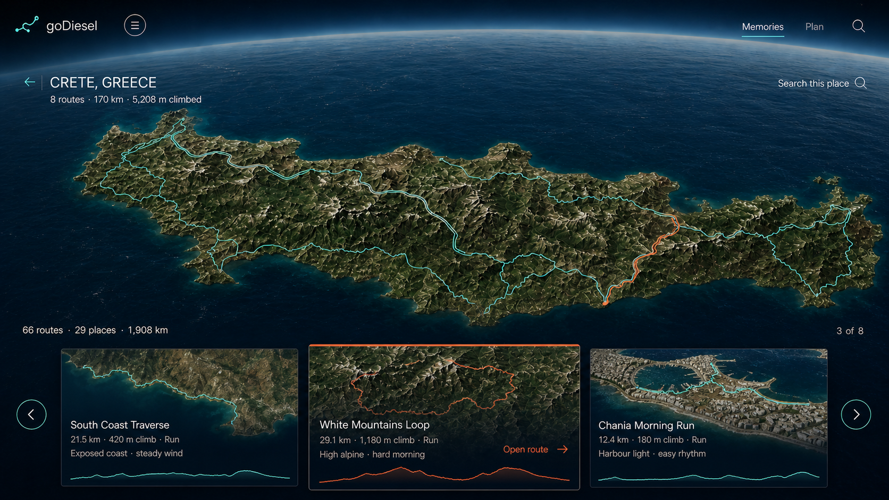

# Spatial Atlas Region Exploration

## Approved Reference

The reference image is normative for composition, hierarchy, and interaction intent.

Route names, route imagery, measurements, and editorial phrases shown in the prototype are illustrative unless they exist in the route manifest or reviewed curation data.

## Problem Statement

The current Atlas shows where completed routes exist, but selecting a region opens a conventional inspector over the globe.

That interaction separates place from route selection and makes the product feel like a map dashboard rather than an explorable personal world.

The globe also cannot support a convincing close regional view because its current Earth texture and route geometry are optimized for planetary scale.

The user needs to move continuously from a global memory of where they have traveled into the actual terrain and routes of one place, understand the character of each route, and enter immersive replay without a visual or conceptual jump.

## Solution

Atlas becomes one continuous spatial experience with two camera scales.

At global scale, the user rotates and searches a photorealistic Earth carrying their completed route threads.

Selecting a place flies the same camera into a regional terrain view instead of opening a magnifier, split screen, or side inspector.

At regional scale, all completed routes in that place are grounded on the terrain and a synchronized route carousel emerges from the bottom edge.

Changing the centered carousel card changes the selected route thread on the terrain.

Opening the selected route enters its immersive Replay experience.

The world remains the interface throughout the journey.

## Product Principles

1. Geography remains visible and primary at every state.
2. Global and regional exploration use one continuous 3D scene and one camera model.
3. Route geometry and editorial claims always come from recorded or reviewed source data.
4. Interface chrome appears only when it enables the current geographic task.
5. Carousel selection and terrain selection are two controls for the same route state.
6. Motion explains spatial continuity and never becomes decorative.
7. The Atlas can be visually dark without imposing a global dark theme on Finder, Routes, Admin, or route detail.

## User Stories

1. As the owner of the Atlas, I want the application to open on my world, so that my accumulated route history is the first thing I experience.
2. As the owner of the Atlas, I want to rotate and zoom the globe, so that I can explore where I have run and ridden.
3. As the owner of the Atlas, I want completed routes to appear as fine geographic threads instead of oversized markers, so that route density is visible without obscuring the Earth.
4. As the owner of the Atlas, I want a small place label to show how many routes exist there, so that I know where deeper exploration is available.
5. As the owner of the Atlas, I want to select a place directly on the globe, so that I can explore it without using a separate route directory.
6. As the owner of the Atlas, I want the camera to fly continuously from the globe into the selected place, so that the regional view feels like part of the same world.
7. As the owner of the Atlas, I want the selected place to fill the viewport with surrounding geographic context, so that I understand the landscape before choosing a route.
8. As the owner of the Atlas, I want every completed route in the selected place to appear on the terrain, so that I can compare where the routes actually go.
9. As the owner of the Atlas, I want a route carousel to appear only after the place is ready, so that route selection does not compete with global exploration.
10. As the owner of the Atlas, I want several route cards visible at once on desktop, so that I can compare nearby experiences quickly.
11. As the owner of the Atlas, I want adjacent cards to remain partially visible on smaller screens, so that horizontal navigation is discoverable.
12. As the owner of the Atlas, I want the centered route card to control the selected route on the terrain, so that card and map never disagree.
13. As the owner of the Atlas, I want selecting a route thread on the terrain to center its carousel card, so that either interaction path produces the same result.
14. As the owner of the Atlas, I want a route card to show distance, climbing, activity type, elevation shape, and a reviewed vibe, so that I can judge the day before opening it.
15. As the owner of the Atlas, I want route previews to use real geography and recorded route geometry, so that the cards do not feel like generic travel content.
16. As the owner of the Atlas, I want the active route to be visually distinct on both the terrain and its card, so that my selection is unambiguous.
17. As the owner of the Atlas, I want to open the selected route directly in Replay, so that exploration leads naturally into reliving the route.
18. As the owner of the Atlas, I want to return from a selected route to the same place and carousel position, so that I do not lose my browsing context.
19. As the owner of the Atlas, I want Back and Escape to move up one spatial level at a time, so that navigation feels predictable.
20. As the owner of the Atlas, I want region and route selection encoded in the URL, so that refresh, browser history, and shared links restore the same state.
21. As a keyboard user, I want to rotate the world, choose a place, navigate route cards, and open a route without a pointer, so that the Atlas is fully operable.
22. As a touch user, I want to drag the world and swipe the carousel without gesture conflicts, so that the experience works naturally on mobile.
23. As a user who prefers reduced motion, I want camera transitions to resolve quickly without cinematic flight, so that the spatial hierarchy remains understandable without discomfort.
24. As a user on a slow connection, I want a single intentional loading state while regional terrain settles, so that incomplete tiles do not look like a broken world.
25. As a user whose 3D tiles fail, I want the place and routes to remain usable in a geographic fallback, so that API failure does not create a dead end.
26. As the owner of the Atlas, I want Memories and Plan to remain visibly separate modes, so that completed route exploration is not confused with future route planning.

## Experience Model

### Atlas States

| State | URL state | World | Route tray |
| --- | --- | --- | --- |
| Global | no `region` or `route` query | Whole Earth with all completed route threads | Hidden |
| Region loading | `region` query | Camera traveling or regional tiles settling | Hidden, dimensions reserved |
| Region ready | `region` query | Selected place framed with all regional routes | Visible, first eligible route centered |
| Route selected | `region` and `route` queries | Selected route emphasized on terrain | Visible, selected card centered |
| Regional fallback | `region` query plus runtime failure state | Two-dimensional source-backed regional map | Visible and fully usable |

The query parameters are the source of truth for persistent selection.

Transient hover, drag, loading progress, and camera interpolation do not enter the URL.

An invalid region or route parameter is removed with a replace navigation and does not create another history entry.

### Hierarchical Navigation

- Selecting a place adds `region` and enters regional exploration.
- Selecting a route adds `route` without leaving Atlas.
- `Open route` navigates to the canonical Replay path for that route.
- Returning from Replay restores the originating Atlas URL and carousel index.
- Back or Escape clears `route` first, then clears `region`, then leaves Atlas according to browser history.
- The global goDiesel mark returns to the root Atlas state.
- `Memories` represents Atlas and remains selected.
- `Plan` navigates to Finder rather than mixing future routes into the same globe search state.

## Interaction Decisions

### Global World

- Atlas opens as a full-bleed world with no permanent desktop sidebar covering geography.
- The goDiesel mark and a compact menu control provide access to application navigation.
- Mobile retains reachable primary navigation without overlaying the route carousel.
- Completed routes render as fine, terrain-aligned threads.
- Place labels remain small, collision-aware, and subordinate to route geometry.
- Place intensity is communicated by thread density and restrained label metadata, never by marker size.
- Search can find places and completed routes and moves the camera to the selected result.
- Manual globe rotation, wheel or pinch zoom, keyboard rotation, and search all manipulate the same camera target.

### Region Transition

- Selecting a place computes a geographic bounding volume from all valid route points in that region.
- The camera fits the geographic bounds with padding reserved for the place heading and route tray.
- The transition uses a smooth decelerating camera flight between 900 and 1,400 milliseconds.
- Reduced motion replaces the flight with a short crossfade of no more than 150 milliseconds.
- Regional route cards remain hidden until the camera arrives and the minimum useful terrain has loaded.
- A stable loading treatment reserves the final carousel dimensions and reports `Loading Crete terrain` through a polite live region.
- The application does not switch between visibly different map frames, magnifiers, or split views.

### Regional Terrain

- Regional terrain uses photorealistic 3D tiles where available.
- All route polylines clamp to the terrain rather than floating at a fixed world altitude.
- The active route is visually emphasized and all sibling routes remain visible at reduced emphasis.
- Route hit targets are wider than visible strokes to support pointer and touch selection.
- Place title and totals remain unframed over quiet geographic space.
- The back control is an icon with an accessible label and returns to global Atlas.
- Search changes to `Search this place` and filters or centers regional routes without leaving the region.

### Route Carousel

- The carousel is controlled by the selected route slug and does not own a competing copy of selection state.
- The implementation uses the shadcn-compatible Embla carousel primitives.
- Desktop shows three cards with the selected card centered and adjacent cards visible.
- Tablet shows two cards with a partial next card.
- Mobile shows one primary card with a 12 to 18 percent peek of the next card.
- Carousel movement snaps to one route at a time and does not loop.
- Pointer dragging, touch swiping, previous and next buttons, and Left or Right arrow keys all update the same selected route.
- The card count uses a quiet `current of total` label and does not use pagination dots.
- Hover may preview a terrain thread, but only focus, click, swipe completion, or keyboard navigation commits route selection.
- Clicking a terrain thread scrolls the corresponding card into the centered position.
- The selected card uses one restrained coral rule and the active route thread uses the same active-selection color.
- `Open route` is the only primary card command and navigates to Replay.
- Carousel loading, empty, one-route, and geometry-failure states preserve stable height.

### Route Card Content

Every card contains the following source-backed information:

- Route name.
- Distance.
- Elevation gain.
- Activity type.
- Elevation profile generated from recorded route points.
- Reviewed vibe when reviewed curation exists.
- Real route geometry over source-backed map or satellite imagery.

Draft or missing curation does not produce invented vibe copy.

When a reviewed vibe is unavailable, the card uses a neutral `Guide not yet reviewed` label.

Satellite thumbnails are requested lazily for visible and immediately adjacent cards only.

The thumbnail request uses a simplified, downsampled path derived from recorded geometry.

If the imagery request fails, the card falls back to a deterministic route trace and elevation profile rather than a placeholder photograph.

## Implementation Decisions

### Single World Renderer

Atlas will move from its current Three.js-only world renderer to a dedicated Cesium-based Atlas world engine.

The engine will own both global and regional camera states so that selecting a region never swaps the user into a separate map component.

The global state uses a lightweight Earth imagery layer and completed route threads.

The regional state activates photorealistic 3D tiles at the altitude where their detail becomes useful.

Existing Cesium setup, tile loading, terrain clamping, camera clearance, and failure-handling logic from Replay should be extracted into shared low-level utilities.

Replay playback state and controls remain separate from Atlas exploration state.

The current Three.js globe remains available behind a temporary feature flag until the new Atlas passes live visual and performance gates.

### Atlas Controller

A single Atlas controller derives the current state from route data and URL parameters.

It coordinates camera intent, selected region, selected route, carousel index, search scope, and loading status.

The controller exposes semantic commands such as select region, clear region, select route, open route, and restore global view.

Rendering components consume controller state and do not mutate URL parameters independently.

### Geographic Bounds

Region bounds are derived from all valid route points rather than averaging route centers.

Bounds calculations account for antimeridian crossings and invalid or missing geometry.

Camera distance is calculated from geographic span and viewport-safe insets rather than fixed per-region constants.

The selected route may adjust the camera target slightly but does not initiate another large cinematic flight.

### Route Rendering

Global and regional threads use the same recorded geometry with scale-specific sampling.

Global rendering downsamples aggressively to protect frame rate.

Regional rendering preserves enough geometry to follow actual terrain while applying a bounded point budget.

Visible route width remains stable in screen space within the regional altitude range.

Selected and unselected styles are semantic and shared between the carousel and world engine.

This specification supersedes the current Atlas-only color rule by allowing coral to identify the actively selected route.

Replay retains its existing current-position and playback color semantics.

### Route Thumbnails

Cards use a small thumbnail adapter rather than embedding independent live maps.

The primary adapter uses a static satellite image endpoint with the recorded route path overlaid.

Only visible and adjacent cards load thumbnails.

The adapter returns explicit ready, loading, unavailable, and error states.

The deterministic SVG route-trace fallback is always available and requires no network access.

No generic stock image or invented terrain image is permitted.

### Carousel Primitive

The existing shadcn component layer will gain the Embla-backed carousel primitive.

The Atlas route tray wraps that primitive with route-specific selection, keyboard behavior, responsive sizing, and terrain synchronization.

Carousel internals do not leak into Atlas controller or route domain modules.

### Shell And Navigation

Atlas uses an immersive shell on desktop with compact navigation access instead of the permanent content spine.

Other application surfaces retain their current shell until separately redesigned.

The menu exposes Atlas, Finder, Routes, Replay, and Admin with current-location state and full keyboard support.

The compact shell must not create a dead end or require editing the URL.

### Failure And Fallback

Repeated 3D tile failures or a persistently blank render state move Atlas into the regional fallback state.

The fallback uses a source-backed two-dimensional map with the same route selection and carousel contracts.

The user sees one concise status message, `3D terrain partially unavailable`, rather than raw provider errors.

Failure does not clear region or route URL state.

### Performance

Only one world renderer exists at a time.

The application does not mount one map renderer per route card.

Route geometry is memoized by slug and sampling level.

Thumbnail loading is lazy and cancellable when cards leave the relevant window.

The regional carousel waits for useful terrain but does not wait for every visible tile to reach maximum resolution.

The desktop target is a responsive 30 frames per second or better during camera movement on the current development machine.

Loading and camera state expose test-only data attributes without exposing provider internals to product components.

## Testing Decisions

The highest-value test seam is the real Atlas route in the browser.

Tests should assert observable URL, camera-state, carousel, route-highlight, navigation, and fallback behavior rather than component implementation details.

### Unit Tests

- Region geographic bounds from valid route geometry.
- Antimeridian and invalid-geometry behavior.
- Atlas URL state parsing and invalid-state recovery.
- Route slug to carousel index synchronization.
- Geometry sampling at global and regional scales.
- Thumbnail request construction and deterministic fallback selection.

### Browser Tests

- Root navigation opens global Atlas.
- Selecting a globe place adds the region query and reaches region-ready state.
- Region-ready state shows terrain, regional threads, and carousel without overlapping primary controls.
- Centering a carousel card updates the route query and selected terrain thread.
- Clicking a terrain thread centers the matching carousel card.
- Previous, next, swipe, keyboard, and direct-card selection remain synchronized.
- Refresh and browser Back or Forward restore region and route selection.
- `Open route` reaches the canonical Replay route and Back restores Atlas context.
- One-route regions disable carousel navigation without changing layout.
- Missing reviewed curation never displays invented vibe copy.
- Thumbnail failure displays the route-trace fallback.
- Tile failure preserves a usable regional fallback and URL state.
- Search behavior changes correctly between global and regional scope.
- Escape and Back move up the spatial hierarchy one level at a time.

### Visual And Canvas Tests

- Desktop verification at 1440 by 900 and 1280 by 800.
- Tablet verification at 834 by 1112 and 1024 by 768.
- Mobile verification at 390 by 844 and 430 by 932.
- Pixel checks prove the world canvas is nonblank in global, transition-complete, and regional states.
- Pixel checks prove the selected route is visible against both urban and mountain terrain.
- Screenshots prove the carousel does not cover the place title, search, navigation, or required map attribution.
- Screenshots prove no horizontal overflow and no clipped card content.
- Reduced-motion screenshots prove that spatial state remains clear without camera flight.

### Live Provider Gate

A separate live Playwright project verifies real 3D tiles and real static thumbnails using configured local credentials.

The default deterministic suite must remain runnable without network credentials.

The live gate records screenshots for global Earth, one urban region, one mountainous region, thumbnail success, and the route-selected state.

## Acceptance Criteria

1. Atlas opens as a full-bleed global world with all valid completed route threads.
2. Selecting a place produces one continuous camera journey into a source-backed regional view.
3. No magnifier, split map, permanent region inspector, or second visible map frame appears.
4. Regional route threads conform to terrain and do not visibly float above it.
5. The route carousel appears only at regional scale and supports pointer, touch, and keyboard navigation.
6. Carousel selection and terrain selection always identify the same route.
7. Region and route state survive refresh and browser history navigation.
8. `Open route` enters the canonical Replay experience and Back restores Atlas context.
9. Cards show only source-backed route facts and reviewed editorial language.
10. Missing imagery, curation, geometry, or 3D tiles has an intentional usable fallback.
11. Desktop, tablet, and mobile layouts have no overlap, clipping, or horizontal overflow.
12. Global and regional canvas pixel checks are nonblank and selected route contrast is visible.
13. Reduced motion, keyboard interaction, focus visibility, and accessible labels pass verification.
14. The default build, typecheck, unit suite, deterministic end-to-end suite, and bundle budget pass.
15. The live provider gate passes on at least one urban and one mountainous region before production cutover.

## Delivery Slices

### Slice 1: Atlas State And Camera Contract

Build the Atlas controller, URL hierarchy, geographic bounds, and world-engine interface.

Keep the existing globe behind the feature flag while deterministic behavior tests land.

### Slice 2: Single Cesium World

Implement global Earth, route threads, place selection, regional camera flight, tile loading, terrain clamping, and fallback behavior.

Verify urban and mountain routes with live provider tests.

### Slice 3: Regional Route Carousel

Add the Embla primitive, route tray, card content, selected-route synchronization, elevation profiles, and fallback thumbnails.

Verify pointer, touch, keyboard, responsive, and URL behavior.

### Slice 4: Source-Backed Thumbnails And Editorial Content

Add lazy static satellite thumbnails, reviewed-vibe rules, loading states, and imagery fallbacks.

Verify no fabricated content appears.

### Slice 5: Immersive Shell And Production Cutover

Replace Atlas desktop spine with compact navigation access, complete responsive polish, run visual and live release gates, then remove the feature flag and obsolete Atlas inspector path.

## Out Of Scope

- Finder route generation or route planning changes.
- Community discovery, public publishing, comments, likes, or collaborative curation.
- Replay camera, playback, or route-thread redesign.
- Route detail, Routes ledger, or Admin visual redesign.
- New route ingestion or Strava synchronization.
- Automated generation of editorial vibe language.
- Weather, lodging, parking, booking, or travel logistics.
- Street-level imagery or dashcam playback.
- Changes to route completion, XP, badges, or quest rules.

## Further Notes

The approved prototype intentionally moves Atlas away from the Weathered Atlas page metaphor while preserving the product truth that routes are memories grounded in real terrain.

The implementation should update the Atlas section of the design contract when production cutover occurs rather than applying the dark spatial treatment globally.

The existing route inspector should remain available until URL restoration, fallback behavior, and carousel accessibility pass the complete release gate.

The reference carousel is inspired by the centered, multi-item Embla interaction pattern, but its product styling and content rules are specific to goDiesel.
